# Цель работы

Изучить инструмент chezmoi для управления конфигурационными файлами (dotfiles) и научиться:

- инициализировать репозиторий dotfiles;
- применять конфигурацию на новой системе;
- синхронизировать изменения;
- использовать chezmoi на нескольких машинах (включая Fedora Toolbox).

---

# Установка и подготовка

## Установка pass

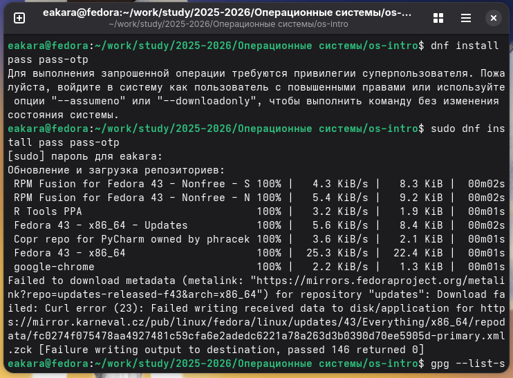{width=100%}

## Просмотр ключей GPG

{width=100%}

## Инициализация хранилища

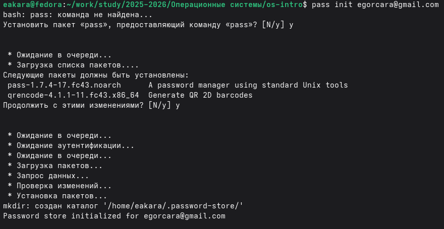{width=100%}

---

# Настройка Git‑репозитория

## Создание структуры Git

{width=100%}

## Создание репозитория на GitHub

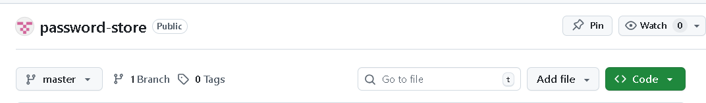{width=100%}

## Добавление удалённого репозитория

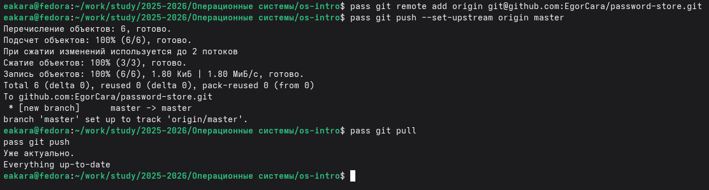{width=100%}

---

# Интеграция с браузером

## Установка расширения

{width=100%}

## Установка browserpass на Fedora

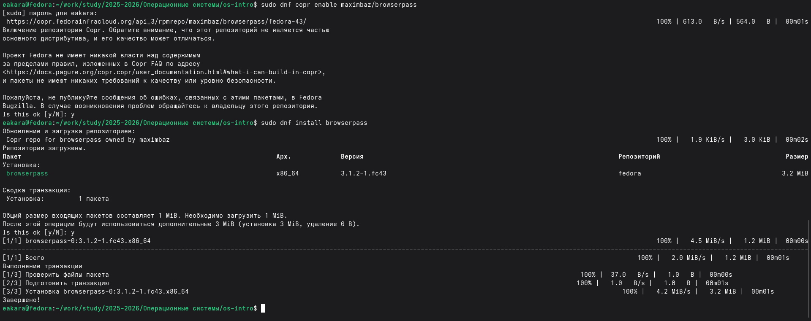{width=100%}

---

# Работа с паролями

## Добавление нового пароля

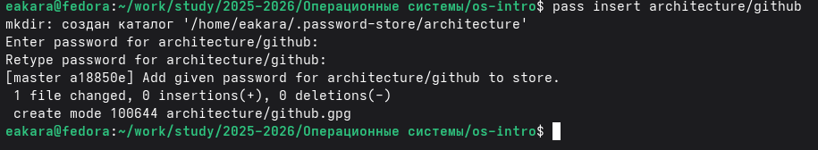{width=100%}

## Просмотр пароля

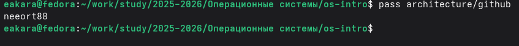{width=100%}

## Замена существующего пароля

{width=100%}

---

# Настройка рабочей среды

## Установка дополнительного ПО

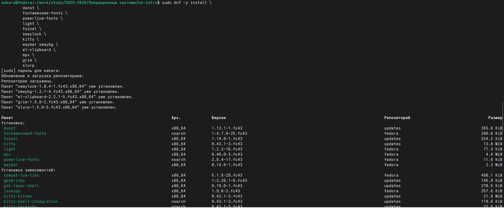{width=100%}

## Установка шрифтов

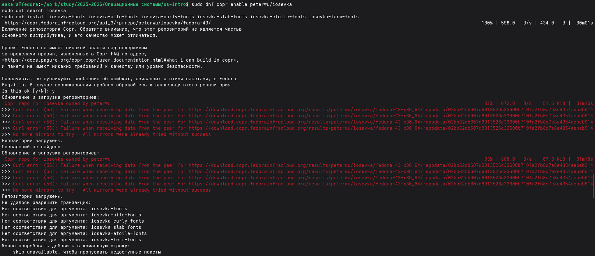{width=100%}

---

# Установка chezmoi

## Установка бинарного файла

{width=100%}

---

# Создание dotfiles‑репозитория

## Создание репозитория из шаблона

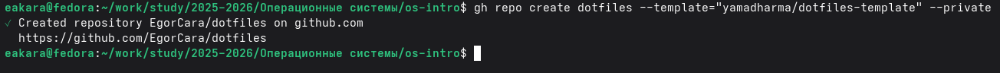{width=100%}

---

# Инициализация chezmoi

## Подключение репозитория

{width=100%}

## Применение конфигурации

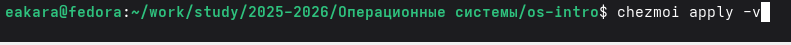{width=100%}

---

# Использование на нескольких машинах

## Синхронизация в Fedora Toolbox

{width=100%}

---

# Вывод

В ходе работы:

- установлен и настроен инструмент chezmoi;
- создан и использован репозиторий dotfiles;
- выполнена синхронизация конфигурации на второй машине (Fedora Toolbox);
- изучены команды для ежедневной работы с dotfiles.

Цель работы достигнута.
