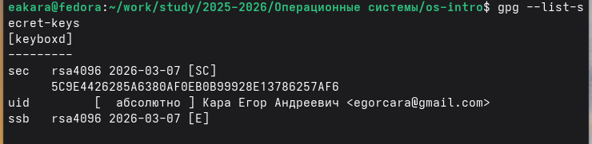
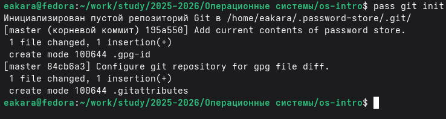
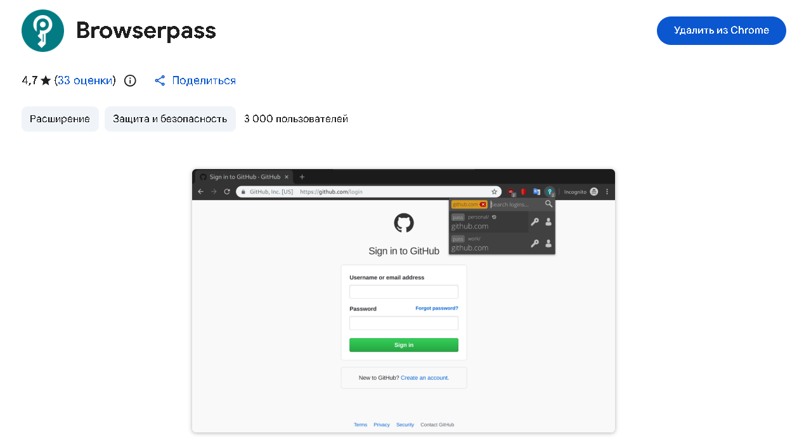
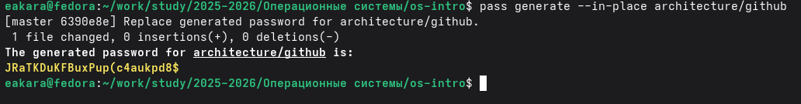
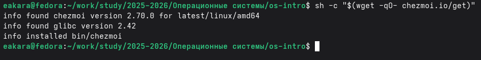
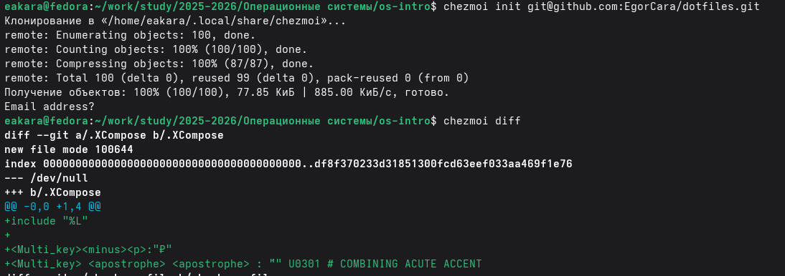
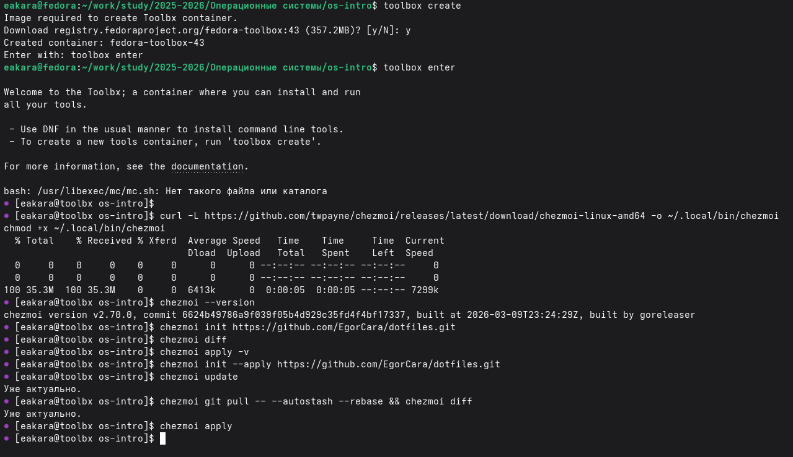

---
## Author
author:
  name: Кара Егор Андреевич
  email: 1032253851@rudn.ru
  affiliation:
    - name: Российский университет дружбы народов
      country: Российская Федерация
      postal-code: 117198
      city: Москва
      address: ул. Миклухо-Маклая, д. 6

## Title
title: "Операционные системы"
subtitle: "Настройка рабочей среды"
license: "CC BY"
---

# Цель работы

Изучить инструмент **chezmoi** для управления конфигурационными файлами (dotfiles), научиться:

- инициализировать репозиторий dotfiles,
- применять конфигурацию на новой системе, 
- синхронизировать изменения, 
- использовать chezmoi на нескольких машинах (в том числе в контейнере Fedora Toolbox).

# Выполнение лабораторной работы

## Устанавливаю pass

{#fig-001 width=100% height=70%}

## Просматриваю список ключей

{#fig-002 width=100% height=70%}

## Инициализируем хранилище

{#fig-003 width=100% height=70%}

## Создадим структуру git

{#fig-004 width=100% height=70%}

## Предворительно создаю репозиторий

{#fig-005 width=100% height=25%}

## Задаем адрес репозитория на хостинге

{#fig-006 width=100% height=70%}

## Устанавливаем плагин для браузера

{#fig-007 width=100% height=70%}

## Устанавливаем интерфейс для взаимодействия с браузером на Fedora

{#fig-008 width=100% height=70%}

## Добавляем новый пароль

![Добавление нового пароля (pass insert [OPTIONAL DIR]/[FILENAME])](image/900.PNG){#fig-009 width=100% height=70%}

## Отображаем пароль для указанного имени файла

![Отображение пароля для указанного имени файла (pass [OPTIONAL DIR]/[FILENAME])](image/1000.PNG){#fig-010 width=100% height=25%}

## Заменим существующий пароль

{#fig-011 width=100% height=25%}

## Установим дополнительное программное обеспечение

{#fig-012 width=100% height=70%}
         
## Установим шрифты

{#fig-013 width=100% height=70%}

## Установим бинарный файл с помощью wget. Скрипт определяет архитектуру процессора и операционную систему и скачивает необходимый файл

{#fig-014 width=100% height=25%}

## Создаем собственный репозиторий с помощью утилит. Будем использовать утилиты командной строки для работы с github.
Создадим свой репозиторий для конфигурационных файлов на основе шаблона

{#fig-015 width=100% height=25%}

## Инициализируем chezmoi с репозиторием dotfiles и проверяем, какие изменения внесёт chezmoi в домашний каталог, запустив: chezmoi diff

{#fig-016 width=100% height=70%}

## Применяем настройки, которые ранее установили

{#fig-017 width=100% height=25%}

## Используем chezmoi на нескольких машинах

{#fig-018 width=100% height=70%}

# Вывод

В ходе работы был установлен и настроен инструмент chezmoi, создан и использован репозиторий dotfiles, выполнена синхронизация конфигурации на второй машине (Fedora Toolbox), изучены команды для ежедневной работы с dotfiles. Цель работы достигнута.

