# Цель работы

Приобретение практических навыков взаимодействия пользователя с системой посредством командной строки.

---

## Определение полного имени домашнего каталога. Далее относительно этого каталога будут выполняться последующие упражнения.

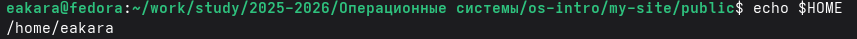{width=100%}

---

# Работа с каталогами.

## Переход в каталог /tmp.

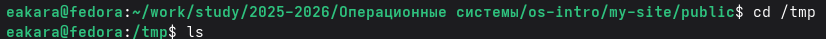{width=100%}

## Вывод на экран содержимое каталога /tmp. Для этого используется команду ls с различными опциями.

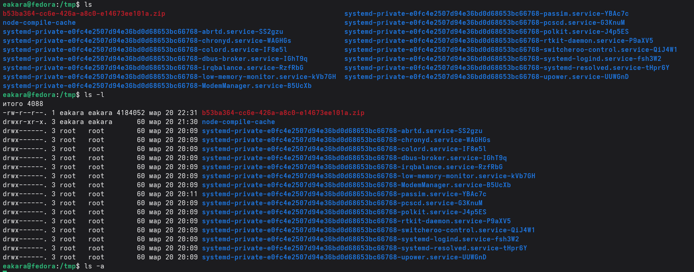{width=100%}

## Выведу на экран содержимое каталога /tmp. Для этого использую команду ls с различными опциями. 

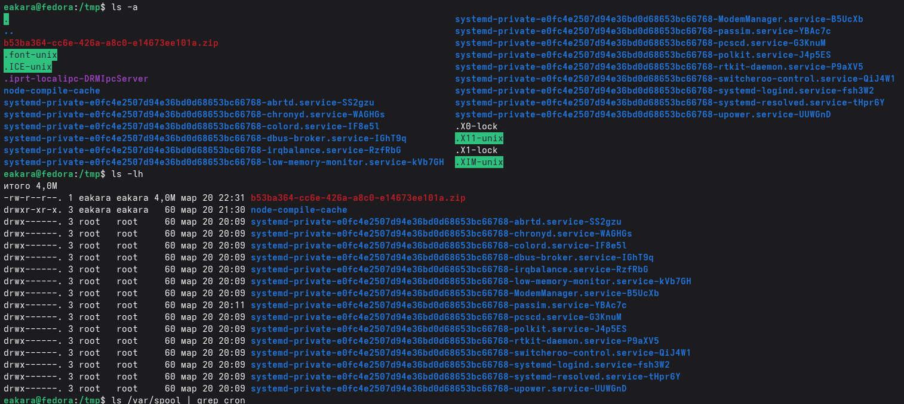{width=100%}

##  Определение, есть ли в каталоге /var/spool подкаталог с именем cron

{width=100%}

##  Переход в домашний каталог и вывод на экран содержимого.

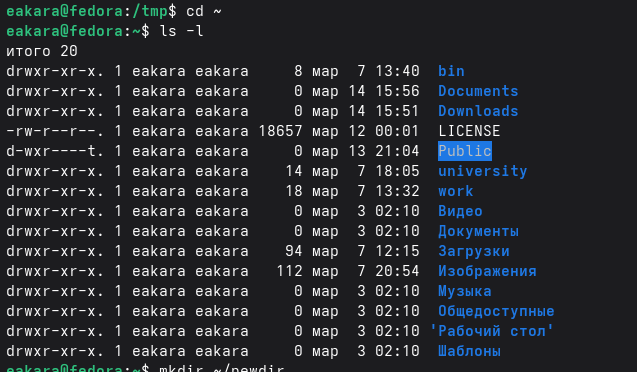{width=100%}

---

# Создание новых каталогов.

## Создание в домашнем каталоге нового каталога с именем newdir.

{width=100%}

##  Создание в каталоге ~/newdir нового каталог с именем morefun.

{width=100%}

## Создание в домашнем каталоге одной командой три новых каталога с именами
letters, memos, misk. Затем происходит удаление этих каталогов одной командой.

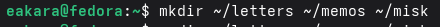{width=100%}

{width=100%}

##  Удаление ранее созданного каталога ~/newdir командой rm. Проверка,
был ли каталог удалён.

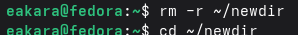{width=100%}

##  Удаление каталога ~/newdir/morefun из домашнего каталога. Проверка, был ли
каталог удалён.

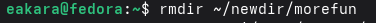{width=100%}

---

# Опция команды ls.

## С помощью команды man определите, какую опцию команды ls нужно использовать для просмотра содержимое не только указанного каталога, но и подкаталогов,
входящих в него.

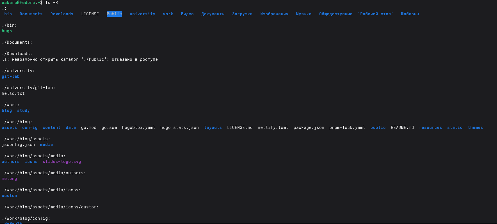{width=100%}

---

# Определение набора опций команды ls с помощью команды man.

## Определение набора опций команды ls с помощью команды man, позволяющий отсортировать по времени последнего изменения выводимый список содержимого каталога
с развёрнутым описанием файлов.

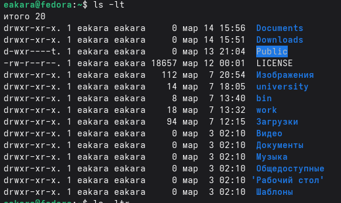{width=100%}

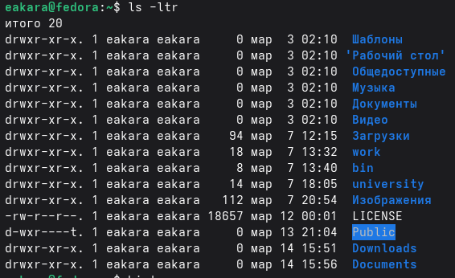{width=100%}

# Использование информации, полученную при помощи команды history и выполнение модификации и исполнение нескольких команд из буфера команд.

## Просмотр истории команд (history)

{width=100%}

## Выполнение команды из истории (ls !(номер строки))

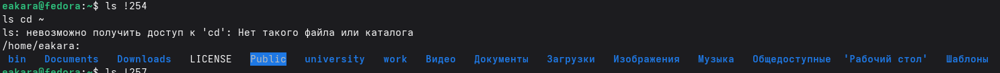{width=100%}

## Показ команды из истории, не выполняя её (ls !(номер):p)

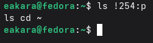{width=100%}

---

# Вывод

Приобретение практических навыков взаимодействия пользователя с системой посредством командной строки.
