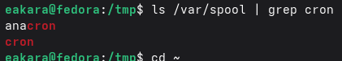
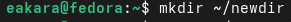
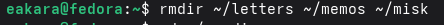
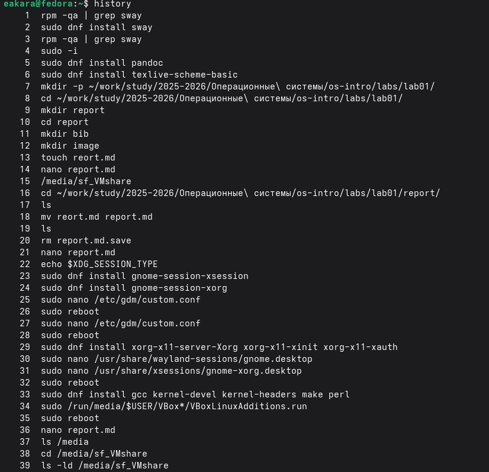

---
## Author
author:
  name: Кара Егор Андреевич
  email: 1032253851@rudn.ru
  affiliation:
    - name: Российский университет дружбы народов
      country: Российская Федерация
      postal-code: 117198
      city: Москва
      address: ул. Миклухо-Маклая, д. 6

## Title
title: "Операционные системы"
subtitle: "Основы интерфейса взаимодействия пользователя с системой Unix на уровне командной строки"
---

# Цель работы

Приобретение практических навыков взаимодействия пользователя с системой посредством командной строки.

# Выполнение лабораторной работы

## Определяю полное имя домашнего каталога. Далее относительно этого каталога будут выполняться последующие упражнения.

{#fig-001 width=100% height=10%}

## Перехожу в каталог /tmp.

{#fig-002 width=100% height=10%}

## Выведу на экран содержимое каталога /tmp. Для этого использую команду ls
с различными опциями. 

{#fig-003 width=100% height=70%}

{#fig-004 width=100% height=70%}

## Определяю, есть ли в каталоге /var/spool подкаталог с именем cron

{#fig-005 width=100% height=15%}

## Перехожу в домашний каталог и вывожу на экран его содержимое. 

{#fig-006 width=100% height=25%}

## В домашнем каталоге создаю новый каталог с именем newdir.

{#fig-007 width=100% height=10%}

## В каталоге ~/newdir создаю новый каталог с именем morefun.

{#fig-008 width=100% height=10%}

## В домашнем каталоге создаю одной командой три новых каталога с именами
letters, memos, misk.

{#fig-09 width=100% height=10%}

## Затем удаляю эти каталоги одной командой.

{#fig-010 width=100% height=10%}

## Удаляю ранее созданный каталог ~/newdir командой rm. Проверяю,
был ли каталог удалён.

{#fig-011 width=100% height=10%}

## Удаляю каталог ~/newdir/morefun из домашнего каталога. Проверьте, был ли
каталог удалён.

{#fig-012 width=100% height=10%}

## С помощью команды man определяю, какую опцию команды ls нужно использовать для просмотра содержимое не только указанного каталога, но и подкаталогов,
входящих в него.

{#fig-013 width=100% height=25%}

## С помощью команды man определяю набор опций команды ls, позволяющий отсортировать по времени последнего изменения выводимый список содержимого каталога
с развёрнутым описанием файлов.

{#fig-014 width=100% height=70%}

{#fig-015 width=100% height=70%}
         
## Используя информацию, полученную при помощи команды history, выполняю модификацию и исполнение нескольких команд из буфера команд: смотрю историю команд (history); выполняю команду из истории (ls !(номер строки)); показываю команду из истории, не выполняя её (ls !(номер):p)

{#fig-016 width=100% height=70%}

{#fig-017 width=100% height=15%}

{#fig-018 width=100% height=30%}

# Вывод

Приобрели практические навыки взаимодействия пользователя с системой посредством командной строки.

# Контрольные вопросы

1.	Что такое командная строка?
Ответ: текстовый интерфейс взаимодействия пользователя с системой

2.	При помощи какой команды можно определить абсолютный путь текущего каталога? Приведите пример.
Ответ: команда pwd, пример:
-	cd /var/www
-	pwd
-	/var/www/

3.	При помощи какой команды и каких опций можно определить только тип файлов и их имена в текущем каталоге? Приведите примеры.
Ответ: команда ls с опцией -F.

4.	Какие файлы считаются скрытыми? Как получить информацию о скрытых файлах? Приведите примеры.
Ответ: Некоторые файлы в операционной системе скрыты от просмотра и обычно используются для настройки рабочей среды. Имена таких файлов начинаются с точки. информацию о них можно получить с помощью команды ls с опцией -a.

5.	При помощи каких команд можно удалить файл и каталог? Можно ли это сделать одной и той же командой?
Ответ: С помощью команды rm можно удалить как отдельный файл так и целый каталог, в случае каталога необходимо указать опцию -r.

6.	Как определить, какие команды выполнил пользователь в сеансе работы? Ответ: с помощью команды history.

7.	Каким образом можно исправить и запустить на выполнение команду, которую пользователь уже использовал в сеансе работы? Приведите примеры Ответ: узнать порядковый номер этой команды с помощью history
затем изменить её сл. образом:
!<номер_команды>:s/<что_меняем>/<на_что_меняем>

8.	Можно ли в одной строке записать несколько команд? Если да, то как? Приведите примеры 

Ответ: да, можно, необходимо разделить команды символом точки с запятой в таком случае они будут выполняться последовательно в том порядке, в котором они записаны пример: cd /tmp/; ls -l;pwd

9.	Что такое символ экранирования? Приведите примеры использования этого символа.
Ответ: символ экранирования \ (обратный слэш) - символ, экранирующие управляющие конструкции и символы в названии файлов и папок Пример: ls /etc/nginx

10.	Какая информация выводится на экран о файлах и каталогах, если используется опция l в команде ls?
Ответ: тип файла, право доступа, число ссылок, владелец, размер, дата последней ревизии, имя файла или каталога.

11.	Что такое относительный путь к файлу? Приведите примеры использования относительного и абсолютного пути при выполнении какой-либо команды. 
Ответ: относительный путь - путь к тому или иному файлу или директории относительной текущей рабочей директории, пример:
папка /www/ в директории /var/ абсолютный путь: /var/www/
относительный путь(если рабочая директория - /var/): /www/

12.	Как получить информацию об интересующей вас команде?
Ответ: можно попробовать найти информацию по использованию с помощью утилиты man, или попробовать ввести опцию --help.

13.	Какая клавиша или комбинация клавиш служит для автоматического дополнения вводимых команд?
Ответ: клавиша Tab.
