# Цель работы

Ознакомление с файловой системой Linux, её структурой, именами и содержанием каталогов. Приобретение практических навыков по применению команд для работы с файлами и каталогами, по управлению процессами (и работами), по проверке использования диска и обслуживанию файловой системы.

---

# Копирование файлов и каталогов

## Копирую файл в текущем каталоге. Копирую файл ~/abc1 в файл april и в файл may:

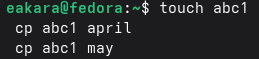{width=100%}

## Копирую несколько файлов в каталог. Копирую файлы april и may в каталог monthly:

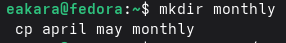{width=100%}

## Копирую файлы в произвольном каталоге. Скопирую файл monthly/may в файл с именем june:

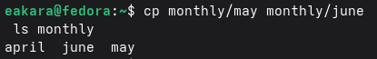{width=100%}

## Копирую каталоги в текущем каталоге. Скопирую каталог monthly в каталог monthly.00:

{width=100%}

## Копирую каталоги в произвольном каталоге. Скопирую каталог monthly.00 в каталог /tmp

{width=100%}

---

# Перемещение и переименование файлов и каталогов

## Переименую файлы в текущем каталоге. Изменяю название файла april на july в домашнем каталоге:

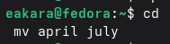{width=100%}

## Перемещаю файлы в другой каталог. Перемещаю файл july в каталог monthly.00:

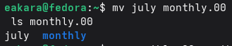{width=100%}

## Переименовываю каталоги в текущем каталоге. Переименовываю каталог monthly.00 в monthly.01

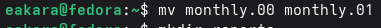{width=100%}

## Перемещаю каталог в другой каталог. Перемещаю каталог monthly.01 в каталог reports:

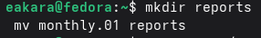{width=100%}

## Переименоваю каталог, не являющегося текущим. Переименовываю каталог reports/monthly.01 в reports/monthly:

{width=100%}

---

#  Права доступа

## Создаю файл, применяю к нему chmod, проверяю ls -l, чтобы увидеть такие же права, как в методичке

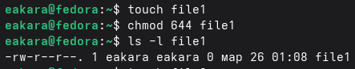{width=100%}

## Создаю файл, применяю к нему chmod, проверяю ls -l, чтобы увидеть такие же права, как в методичке

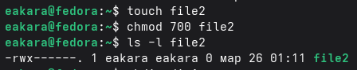{width=100%}

## Создаю каталог, применяю к нему chmod, проверяю ls -l, чтобы увидеть такие же права, как в методичке

{width=100%}

---

# Изменение прав доступа

## Создаю файл ~/may с правом выполнения для владельца:

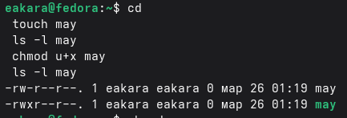{width=100%}

## Лишаю владельца файла ~/may права на выполнение:

{width=100%}

## Создаю каталог monthly с запретом на чтение для членов группы и всех остальных пользователей:

{width=100%}

## Создаю файл ~/abc1 с правом записи для членов группы:

{width=100%}

---

# Анализ файловой системы

## Просматриваю все смонтированные файловые системы:

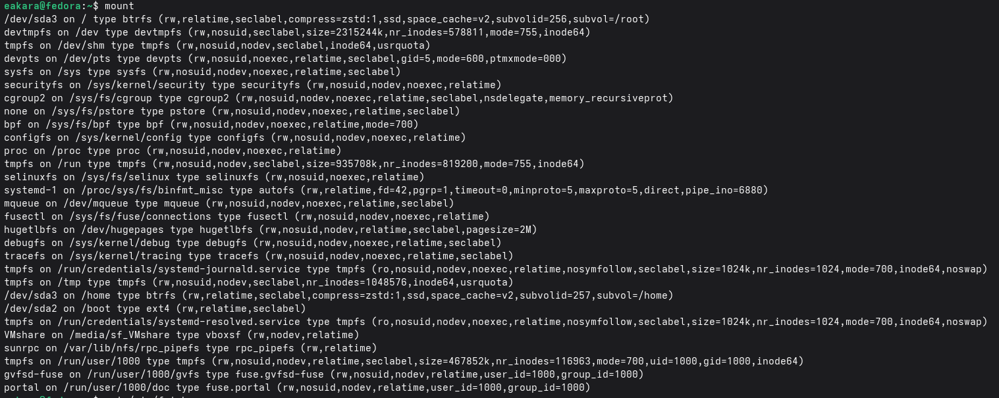{width=100%}

## Просматриваю конфигурацию автоматического монтирования:

{width=100%}

## Просматриваю свободное и занятое место на всех файловых системах:

{width=100%}

## С помощью команды fsck можно проверить (а в ряде случаев восстановить) целостность файловой системы. Смотрю формат:

{width=100%}

---

# Выполняю следующие действия, зафиксировав в отчёте по лабораторной работе используемые при этом команды и результаты их выполнения:

## Копирую файл /usr/include/sys/io.h в домашний каталог и называю его equipment.

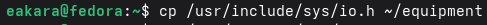{width=100%}

## В домашнем каталоге создаю директорию ~/ski.plases.

{width=100%}

## Перемещаю файл equipment в каталог ~/ski.plases.

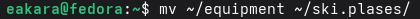{width=100%}

## Переименовываю файл ~/ski.plases/equipment в ~/ski.plases/equiplist.

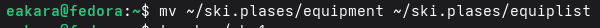{width=100%}

## Создаю в домашнем каталоге файл abc1 и копирую его в каталог ~/ski.plases, называю его equiplist2.

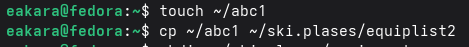{width=100%}

## Создаю каталог с именем equipment в каталоге ~/ski.plases.

{width=100%}

## Перемещаю файлы ~/ski.plases/equiplist и equiplist2 в каталог ~/ski.plases/equipment.

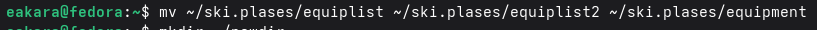{width=100%}

## Создаю и перемещаю каталог ~/newdir в каталог ~/ski.plases и называю его plans.

{width=100%}

---

# Определяю опции команды chmod, необходимые для того, чтобы присвоить перечисленным ниже файлам выделенные права доступа, считая, что в начале таких прав нет:

## Создаю каталог и назначаю ему права с помощью chmod

{width=100%}

## Создаю каталог и назначаю ему права с помощью chmod

{width=100%}

## Создаю файл и назначаю ему права с помощью chmod

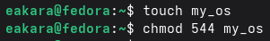{width=100%}

## Создаю файл и назначаю ему права с помощью chmod

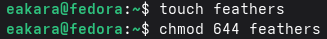{width=100%}

---

# Проделываю приведённые ниже упражнения, записывая в отчёт по лабораторной работе используемые при этом команды:

## Просмотриваю содержимое файла /etc/password.

{width=100%}

## Копирую файл ~/feathers в файл ~/file.old.

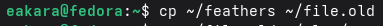{width=100%}

## Перемещаю файл ~/file.old в каталог ~/play.

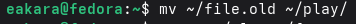{width=100%}

## Копирую каталог ~/play в каталог ~/fun.

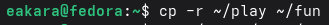{width=100%}

## Перемещаю каталог ~/fun в каталог ~/play и называю его games

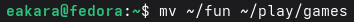{width=100%}

## Лишаю владельца файла ~/feathers права на чтение.

{width=100%}

## Пытаюсь просмотреть файл ~/feathers командой cat. Получаю ошибку, так как у владельца нет права на чтение

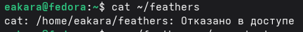{width=100%}

## Пытаюсь скопировать файл ~/feathers. Получаю ошибку, так как копирование требует чтение исходного файла

{width=100%}

## Даю владельцу файла ~/feathers право на чтение.

{width=100%}

## Лишаю владельца каталога ~/play права на выполнение.

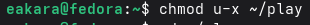{width=100%}

## Перехожу в каталог ~/play. Доступ запрещен, потому что нет права на выполнение каталога.

{width=100%}

## Даю владельцу каталога ~/play право на выполнение.

{width=100%}

---

# Читаю man по командам mount, fsck, mkfs, kill и кратко их характеризую, приведя примеры.

## mount отвечает за монтирование файловых систем. Команда mount подключает файловую систему (раздел, флешку, образ) к каталогу в Linux. Например:

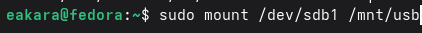{width=100%}

## fsck - проверка и восстановление файловой системы. fsck проверяет файловую систему на ошибки и пытается их исправить. Например:

{width=100%}

## mkfs - создание файловой системы. Создает новую файловую систему на разделе или устройстве. Например:

{width=100%}

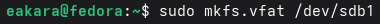{width=100%}

## kill - отправка сигналов процессам. Посылает сигнал процессу. Чаще всего используется для завершения зависших программ. Например:

{width=100%}

{width=100%}

---

# Вывод

Я ознакомился с файловой системой Linux, её структурой, именами и содержаниемкаталогов. Приобрел практические навыки по применению команд для работыс файлами и каталогами, по управлению процессами (и работами), по проверке использования диска и обслуживанию файловой системы.
