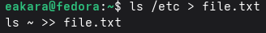
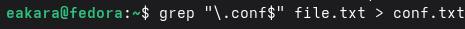
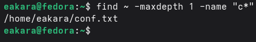
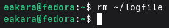
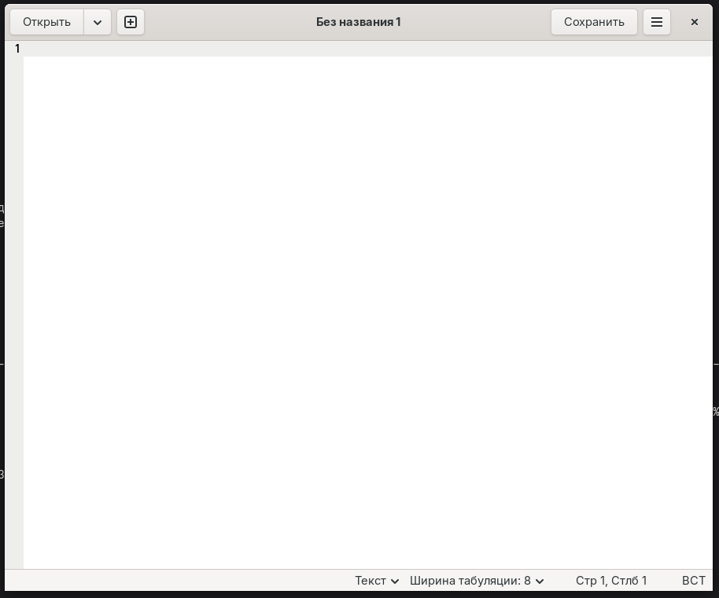
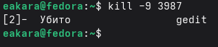
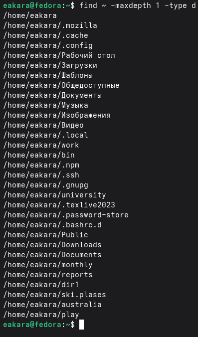

# Цель работы

Ознакомление с инструментами поиска файлов и фильтрации текстовых данных. Приобретение практических навыков: по управлению процессами (и заданиями), по проверке использования диска и обслуживанию файловых систем.

---

# Выполнение лабораторной работы

## Осуществление входа в систему, используя соответствующее имя пользователя.

{width=100%}

## Запись в файл file.txt названия файлов, содержащихся в каталоге /etc. Добавление в этот же файл названия файлов, содержащихся в вашем домашнем каталоге.

{width=100%}

## Вывод имен всех файлов из file.txt, имеющих расширение .conf, после чего происходит запись их в новый текстовой файл conf.txt.

{width=100%}

## Просмотр содержимого файла conf.txt.

{width=100%}

## Определение, какие файлы в домашнем каталоге имеют имена, начинавшиеся с символа c? Первый вариант, как это сделать.

{width=100%}

## Определение, какие файлы в домашнем каталоге имеют имена, начинавшиеся с символа c? Второй вариант, как это сделать.

{width=100%}

## Вывод на экран (по странично) имена файлов из каталога /etc, начинающиеся с символа h.

{width=100%}

## Просмотр имен файлов из каталога /etc, начинающиеся с символа h.

{width=100%}

## Запуск в фоновом режиме процесса, который будет записывать в файл ~/logfile файлы, имена которых начинаются с log.

{width=100%}

## Удаление файла ~/logfile.

{width=100%}

## Запуск из консоли в фоновом режиме редактор gedit.

{width=100%}

## Запуск из консоли в фоновом режиме редактор gedit.

{width=100%}

## Определение идентификатора процесса gedit, используя команду ps, конвейер и фильтр grep. Определение идентификатора процесса остальными способами.

{width=100%}

## Чтение справки (man) команды kill, после чего использование её для завершения процесса gedit.

{width=100%}

## Выполнение команды df. Получение более подробной информации об этих командах, с помощью команды man.

{width=100%}

## Выполнение команды du. Получение более подробной информации об этих командах, с помощью команды man.

{width=100%}

## Вывод имен всех директорий, имеющихся в домашнем каталоге с помощью команды find.

{width=100%}

---

# Вывод

В ходе работы ознакомились с инструментами поиска файлов и фильтрации текстовых данных. Приобрели практические навыки: по управлению процессами (и заданиями), по проверке использования диска и обслуживанию файловых систем.
