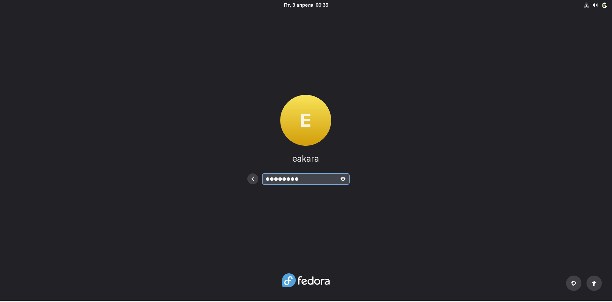
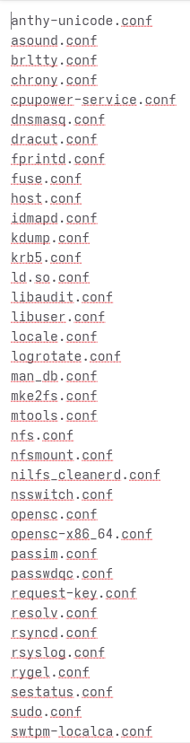
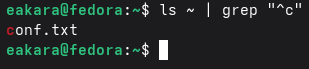
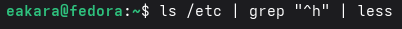
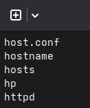
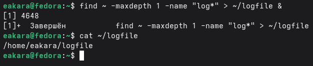
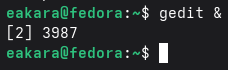
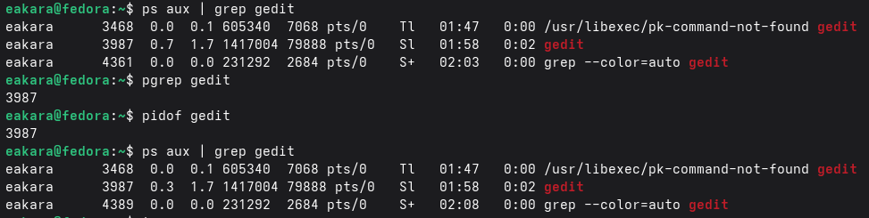
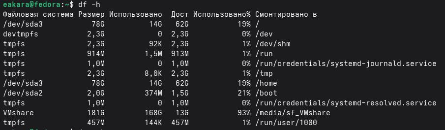
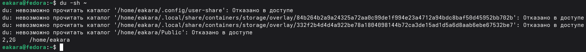

---
## Author
author:
  name: Кара Егор Андреевич
  email: 1032253851@rudn.ru
  affiliation:
    - name: Российский университет дружбы народов
      country: Российская Федерация
      postal-code: 117198
      city: Москва
      address: ул. Миклухо-Маклая, д. 6

## Title
title: "Операционные системы"
subtitle: "Поиск файлов. Перенаправление ввода-вывода. Просмотр запущенных процессов"
---

# Цель работы

Ознакомление с инструментами поиска файлов и фильтрации текстовых данных. Приобретение практических навыков: по управлению процессами (и заданиями), по проверке использования диска и обслуживанию файловых систем.

# Выполнение лабораторной работы

## Осуществляю вход в систему, используя соответствующее имя пользователя.

{#fig-001 width=100% height=40%}

## Записываю в файл file.txt названия файлов, содержащихся в каталоге /etc. Дописываю в этот же файл названия файлов, содержащихся в моём домашнем каталоге.

{#fig-002 width=100% height=10%}

## Вывожу имена всех файлов из file.txt, имеющих расширение .conf, после чего запишите их в новый текстовой файл conf.txt.

{#fig-003 width=100% height=15%}

{#fig-004 width=100% height=65%}

## Определяю, какие файлы в вашем домашнем каталоге имеют имена, начинавшиеся с символа c. Рассматриваю несколько вариантов, как это сделать.

{#fig-005 width=100% height=15%}

{#fig-006 width=100% height=15%}

## Вывожу на экран (по странично) имена файлов из каталога /etc, начинающиеся с символа h.

{#fig-007 width=100% height=10%}

{#fig-008 width=100% height=50%}

## Запускаю в фоновом режиме процесс, который будет записывать в файл ~/logfile файлы, имена которых начинаются с log.

{#fig-009 width=100% height=10%}

## Удаляю файл ~/logfile.

{#fig-010 width=100% height=10%}

## Запускаю из консоли в фоновом режиме редактор gedit.

{#fig-011 width=100% height=10%}

{#fig-012 width=100% height=10%}

##  Определяю идентификатор процесса gedit, используя команду ps, конвейер и фильтр grep. Определяю идентификатор процесса 3 способами

{#fig-013 width=100% height=10%}

## Использую справку (man) команды kill для завершения процесса gedit.

{#fig-014 width=100% height=10%}

## Выполняю команды df и du, предварительно получив более подробную информацию об этих командах, с помощью команды man.

{#fig-015 width=100% height=10%}

{#fig-016 width=100% height=10%}

## Воспользовавшись справкой команды find, вывожу имена всех директорий, имеющихся в моём домашнем каталоге.

{#fig-017 width=100% height=50%}

# Вывод

Ознакомились с инструментами поиска файлов и фильтрации текстовых данных. Приобрели практические навыки: по управлению процессами (и заданиями), по проверке использования диска и обслуживанию файловых систем.

# Контрольные вопросы

1. Какие потоки ввода вывода вы знаете?
Ответ: 
a) stdin — стандартный поток ввода (клавиатура),

b) stdout — стандартный поток вывода (консоль),

c) stderr — стандартный поток вывод сообщений об ошибках на экран

2. Объясните разницу между операцией > и >>
Ответ: 
Разница заключается в том, что Символ > используется для переназначения стандартного ввода команды, а символ >> используется для присоединения данных в конец файла стандартного вывода команды.

3. Что такое конвейер?
Ответ: Конвейер – это способ связи между двумя программами. 
Например: конвейер pipe служит для объединения простых команд или утилит в цепочки, в которых результат работы предыдущей команды передается последующей. 
Синтаксис у конвейера  следующий: команда1 | команда 2

4. Что такое процесс? Чем это понятие отличается от программы?
Ответ: Процесс - это программа, которая выполняется в отдельном виртуальном адресном пространстве независимо от других программ или их пользованию по необходимости. \

5. Что такое PID и GID?
Ответ: Во первых id — UNIX-утилита, выводящая информацию об указанном пользователе USERNAME или текущем пользователе, который запустил данную команду и не указал явно имя пользователя.
1)	GID – (Group ID) - идентификатор группы 
2)	UID – (User ID) - идентификатор группы
Обычно UID  является — положительным целым число м в диапазоне от 0 до 65535, по которому в системе однозначно отслеживаются действия пользователя

6. Что такое задачи и какая команда позволяет ими управлять?
Ответ: Запущенные фоном программы называются задачами(процессами) (jobs). Ими можно управлять с помощью команды jobs, которая выводит список запущенных в данный момент процессов. Для завершения процесса необходимо выполнить команду :
kill % номер задачи

7. Найдите информацию об утилитах top и htop. Каковы их функции?
Ответ: 
Top это консольная команда, которая выводит список работающих в системе процессов и информации о них. По умолчанию она в реальном времени сортирует их по нагрузке на процессор.Htop же является альтернативой программы top она предназначенная для вывода на терминал списка запущенных процессов и информации о них.

8. Назовите и дайте характеристику команде поиска файлов. Приведите примеры использования этой команды.
Ответ: Команда find используется для поиска и отображения имен файлов, соответствующих заданной строке символов.
Синтаксис: find trek [-options]
Пример:
Задача - Вывести на экран имена файлов из каталога /etc и его подкаталогов, Заканчивающихся на k:
find ~ -name "*k" -print

9. Можно ли по контексту (содержанию) найти файл? Если да, то как?
Ответ: Можно, команда grep способна обрабатывать вывод других файлов. Для этого надо использовать конвейер, связав вывод команды с вводом grep.
Пример:
Задача - показать строки в каталоге /dreams с именами начинающимися на t, в которых есть фраза:  I like of Operating systems
grep I like of Operating systems t*

10. Как определить объем свободной памяти на жёстком диске?
Ответ:
Команда df показывает размер каждого смонтированного раздела диска.
Например команда: df -h

11. Как определить объем вашего домашнего каталога?
Ответ: Команда du показывает число килобайт, используемое каждым файлом или каталогом.
Например команда: du -sh

12. Как удалить зависший процесс?
Ответ: Перед тем, как выполнить остановку процесса, нужно определить его PID. Когда известен PID , мы можем убить его командой kill. Команда kill принимает в качестве параметра PID процесса. 
PID можно узнать с помощью команд ps, grep, top или htop
