---
author:
  name: Кара Егор Андреевич
  degrees: student
  email: 1032253851@rudn.ru
  affiliation:
    - name: Российский университет дружбы народов
      country: Российская Федерация
      postal-code: 117198
      city: Москва
      address: ул. Миклухо-Маклая, д. 6

title: "Операционные системы"
subtitle: "Внешний курс. Введение в Linux"
date: today
date-format: "2026-01-05"

format:
  revealjs:
    theme: beige
    slide-number: true
    transition: fade
    center: true
    width: 1280
    height: 720
  beamer:
    theme: metropolis
    slide-level: 2
---

# Информация

## Докладчик

:::::::::::::: {.columns align=center}
::: {.column width="70%"}

  * Кара Егор Андреевич
  * НБИбд-01-25, студент
  * Российский университет дружбы народов им. П. Лумумбы
  * 1032253851@rudn.ru

:::
::: {.column width="30%"}

:::
::::::::::::::

# Цель работы

Целью работы является знакомство с операционной системой Linux и получение базовых навыков работы с терминалом, файловой системой, архивами, процессами и утилитами командной строки.

# Выполнение внешнего курса

## Название курса

Курс представляет собой вводный практический модуль, направленный на освоение базовых команд Linux, понимание структуры ОС и выполнение типовых задач администратора.

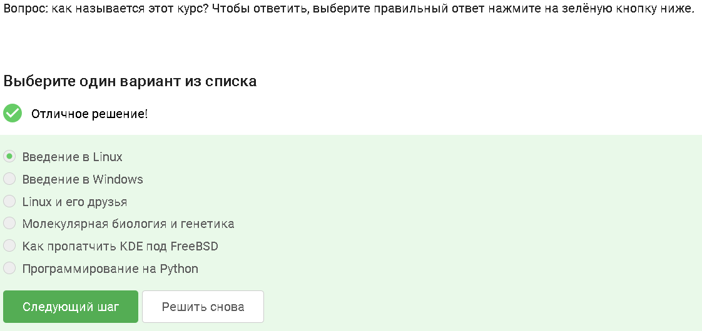

## Условия успешного прохождения курса

Для успешного завершения курса необходимо выполнить все задания, пройти тесты и подтвердить понимание ключевых концепций Linux.

# Установка и запуск Linux

## Основная ОС - Windows

На моем компьютере основная операционная система - Windows. Это важно, так как большинство пользователей начинают знакомство с Linux именно через виртуальные машины.

## Определение виртуальной машины

Виртуальная машина - это программа, позволяющая запускать одну ОС внутри другой. 
Она создает изолированную среду, полностью имитирующую компьютер.

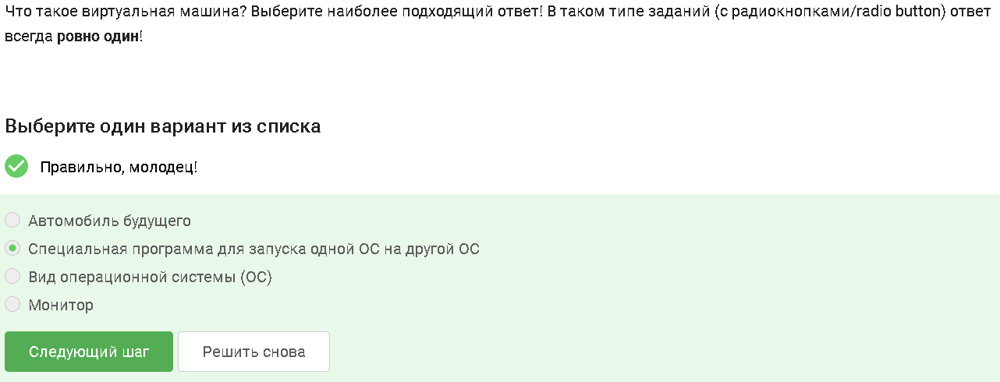

## Запуск Linux

Я успешно установил и запустил Linux в виртуальной машине, что позволило выполнять задания курса в полноценной рабочей среде.

# LibreOffice Writer

## Условие задания

Необходимо создать документ в LibreOffice Writer, используя шрифт FreeMono, и написать строку "Hello, Linux!". Это проверяет базовые навыки работы с графическими приложениями Linux.

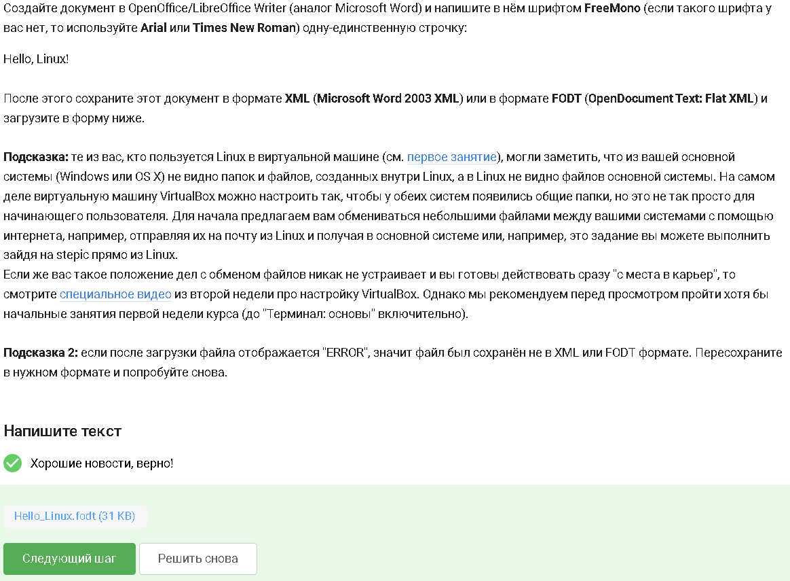

## Выполнение задания 

Документ был успешно создан, шрифт выбран корректно, задание выполнено.

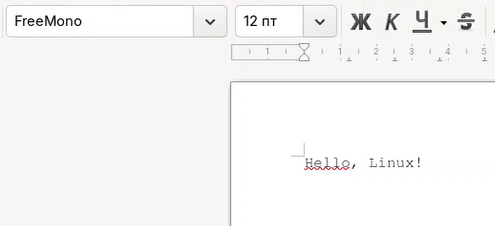

# Пакеты и программы

## Формат .deb

Файлы '.deb' используются в Debian-подобных системах (например, Ubuntu) для установки программ.
Они содержат бинарные файлы, конфигурации и инструкции для пакетного менеджера. 

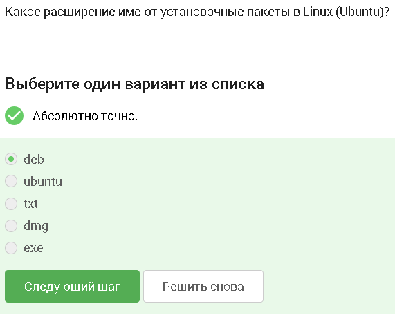

## VLC и фамилия первого автора

В рамках задания необходимо было установить VLC и найти фамилию первого автора в разделе "About". Это демонстрирует работу с графическими приложениями и меню программ.

## Update Manager

Update Manager позволяет обновлять систему, но не устанавливать и не удалять программы.
Это важное различие между обновлением и управлением пакетами

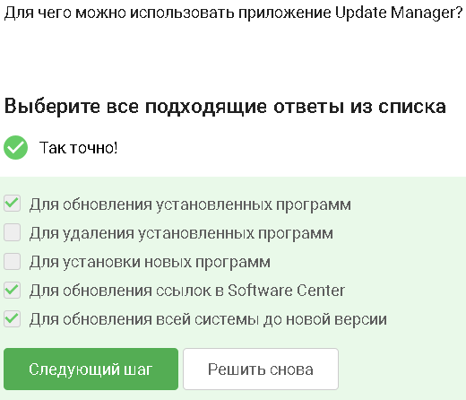

# Командная строка

## Синонимы командной строки

Командная строка имеет несколько корректных названий: терминал, консоль.  
Это базовый инструмент работы в Linux.

## Команда pwd

Команда `pwd` выводит путь к текущей директории.  
Linux чувствителен к регистру, поэтому `PWD` и `pwd` — разные команды.

## Эквивалентность команд ls

Разные варианты команды `ls` могут быть полностью эквивалентны, если используют одинаковые флаги.  
Это помогает понимать сокращения и длинные формы опций.

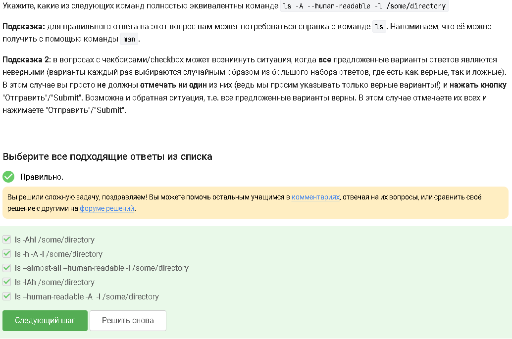

## Команды ls для каталога Downloads

Команды `ls ~/Downloads`, `ls ../Downloads` и `ls /home/bi/Downloads` корректно указывают путь.  
Команда с маской `Do*` может выводить лишние каталоги.

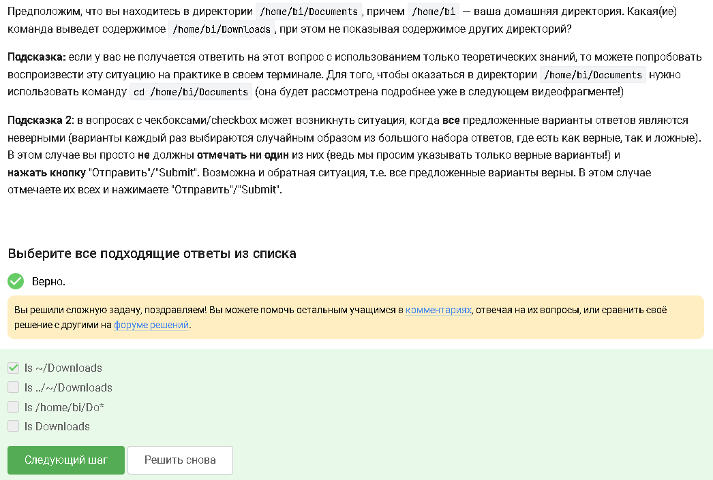

## Команда rm -r

Флаг `-r` позволяет удалять каталоги рекурсивно.  
Команда `rm -rf` используется с осторожностью, так как удаляет без подтверждения.

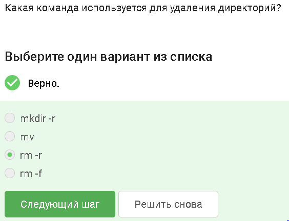

# Процессы

## Кто закроется?

Если процесс (например, Firefox) запущен в терминале, то терминал не закроется, пока процесс работает.  
Это демонстрирует связь родительских и дочерних процессов.

## Ctrl+Z и bg

`Ctrl+Z` останавливает процесс, переводя его в состояние «stopped».  
Команда `bg` возобновляет выполнение в фоновом режиме.

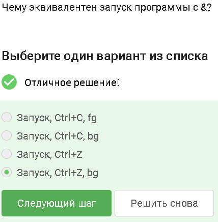

## Пример запуска Python‑скрипта

Пример демонстрирует вывод программы и контрольную сумму.  
Это показывает работу интерпретатора Python в терминале.

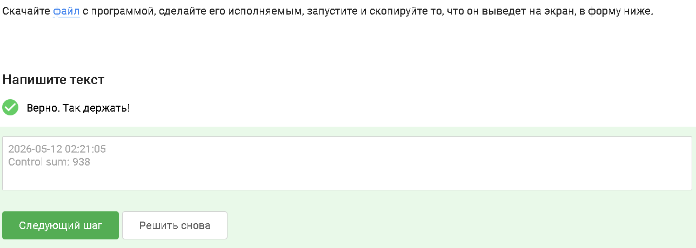

# Потоки ввода-вывода

## Куда выводится stderr?

Поток ошибок (stderr) по умолчанию выводится на экран, как и stdout.  
Это важно для понимания перенаправления потоков.

## Перенаправление ошибок

Команды `2>` и `2>>` позволяют перенаправлять ошибки в файл.  
Это используется для логирования и отладки.

## Ошибка при замене less на nano

При попытке использовать `nano` вместо `less` для чтения бинарного потока возникает ошибка.  
Это демонстрирует различия между программами постраничного просмотра и редакторами.

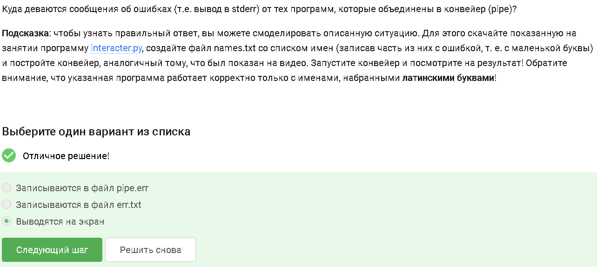

# wget

## Куда скачался файл?

Флаг `-O` задаёт имя файла и игнорирует `-P`.  
Поэтому файл сохраняется в текущую директорию.

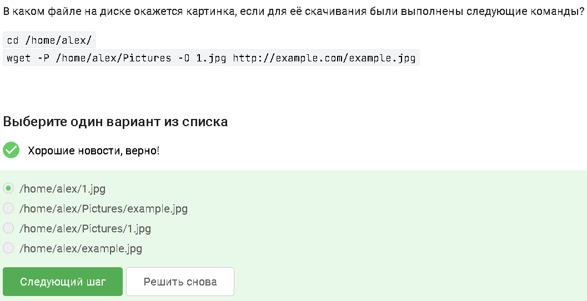

## Опция -q

Флаг `-q` отключает вывод wget, делая загрузку «тихой».

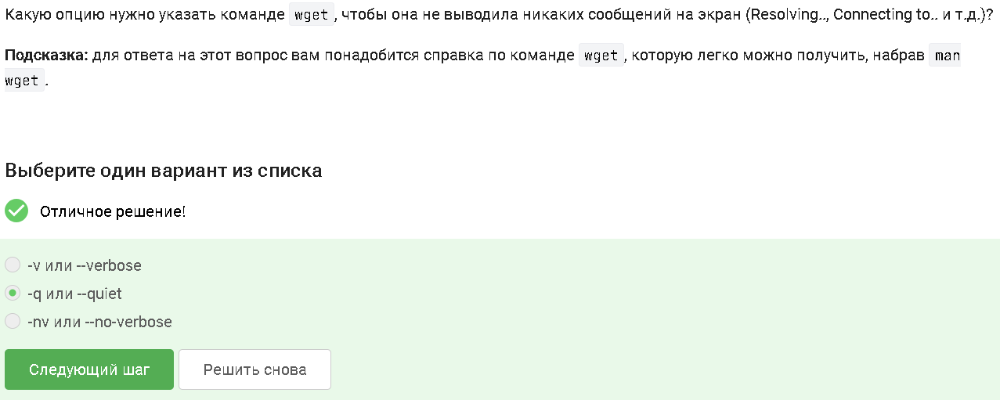

## Какие файлы будут скачаны?

Файлы `.jpg` будут скачаны, а `.html` — скачаны, но затем удалены согласно правилам фильтрации.

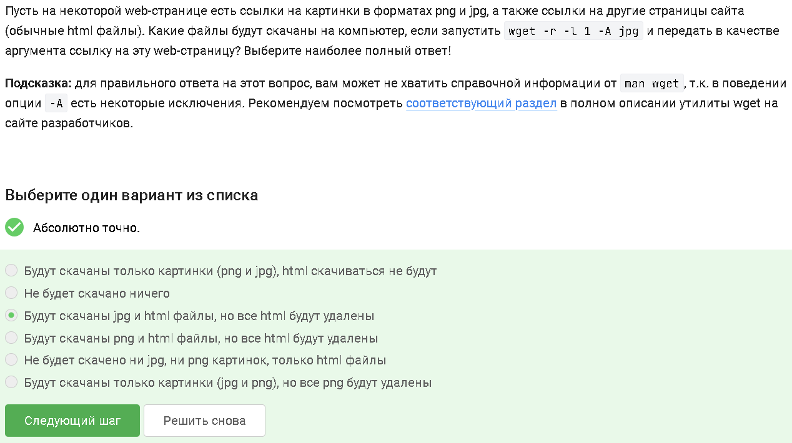

# Архиваторы

## Отличие gzip и zip

`gzip` сжимает один файл и удаляет оригинал.  
`zip` создаёт архив из множества файлов и каталогов.

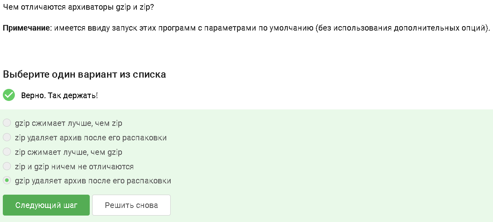

## tar и zip 

'zip' одновременно упаковывает и сжимает.
'tar' объединяет файлы, а сжатие выполняется отдельным флагом ('-z', '-j').

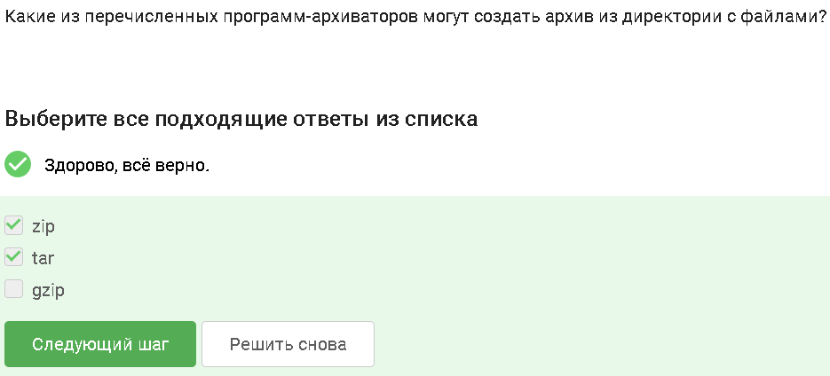

## Создание архива tar.bz2

Флаги '-cjf' создают архив в формате bzip2.
Это один из наиболее эффективных форматов сжатия.

# Поиск файлов 

## Маска, которая НЕ найдет Alexey.jpeg

Маски 'alexey.*', '*.?' и '*.jpg' не подходят для файла 'Alexey.jpeg' из-за регистра и длины расширения.

# grep 

## Какие строки выведет grep "world"

Команда 'grep' ищет строки, содержащие подстроку 'world'.
Это базовый инструмент поиска по тексту.

## Все строки с "love" из Shakespeare

Поиск по всем файлам с помощью grep -r позволяет собирать строки, содержащие слово "love".
Важно исключить файл результата, чтобы избежать рекурсию

.PNG)

# Вывод

В ходе работы я ознакомился с Linux, освоил базовые команды, научился работать с файлами, архивами , процессами и утилитами.
Все задания внешнего курса были успешно выполнены.
