---
author:
  name: Кара Егор Андреевич
  degrees: student
  email: 1032253851@rudn.ru
  affiliation:
    - name: Российский университет дружбы народов
      country: Российская Федерация
      postal-code: 117198
      city: Москва
      address: ул. Миклухо-Маклая, д. 6

title: "Операционные системы"
subtitle: "Внешний курс. Работа на сервере"
date: today
date-format: "2026-01-05"

format:
  revealjs:
    theme: beige
    slide-number: true
    transition: fade
    center: true
    width: 1280
    height: 720
  beamer:
    theme: metropolis
    slide-level: 2
---

# Информация

## Докладчик

:::::::::::::: {.columns align=center}
::: {.column width="70%"}

  * Кара Егор Андреевич
  * НБИбд-01-25, студент
  * Российский университет дружбы народов им. П. Лумумбы
  * 1032253851@rudn.ru

:::
::: {.column width="30%"}

:::
::::::::::::::

# Цель работы

Целью работы является получение практических навыков работы на удаленном сервере: 
подключение по SSH, копирование файлов, запуск программ, управление процессами, использование многопоточных приложений  и терминального мультиплексора tmux.

# Удаленный сервер

## Назначение удаленного сервера

Удаленный сервер можно использовать для хранения больших объемов данных, 
общедоступных данных (например, доступных через интернет),
конфиденциальной информации с ограниченным доступом,
а также для выполнения ресурсоемких вычислений

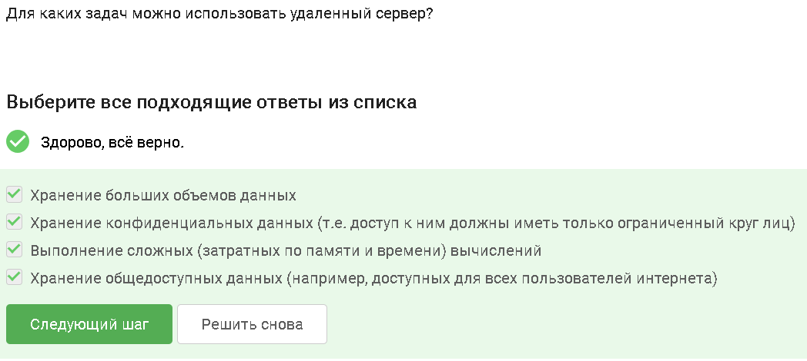

# SSH и ключи

## Открытый ключ id_rsa.pub

Файл 'id_rsa.pub' является открытым ключом.
Его можно безопасно передавать по сети, так как он не позволяет получить доступ без закрытого ключа.
Закрытый ключ хранится локально и не должен покидать машину пользователя.

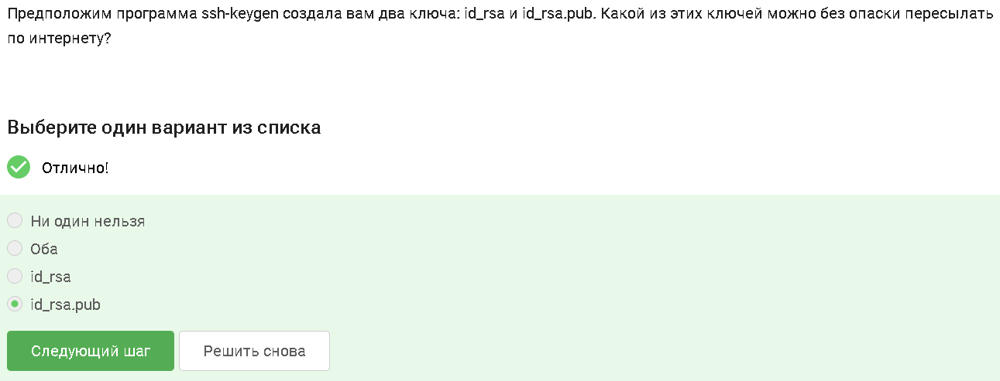

# Копирование файлов

## Команда scp

Команда 'scp -r stepic username@server:~/' копирует на сервер папку 'stepic' вместе со всем ее содержимым и вложенными каталогами.
Варианты с 'ssh' не копируют файлы, а 'scp stepic/*' копирует только файлы без структуры каталогов.

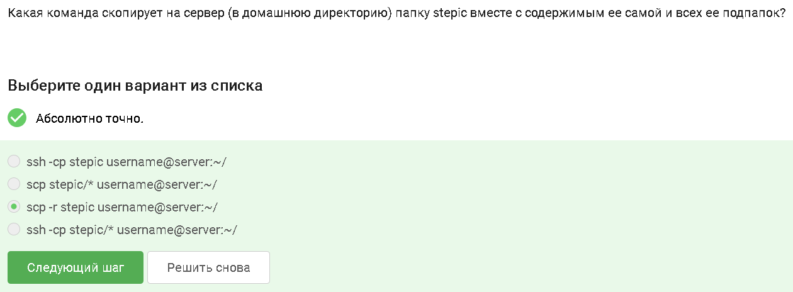

# Обновление системы

## apt update и apt upgrade

Проверка интернет‑соединения и его настройка, а также `sudo apt-get update`  
могут устранить проблемы с установкой пакетов.  
`apt update` синхронизирует списки пакетов,  
`apt upgrade` обновляет установленные пакеты до последних версий, не удаляя их.

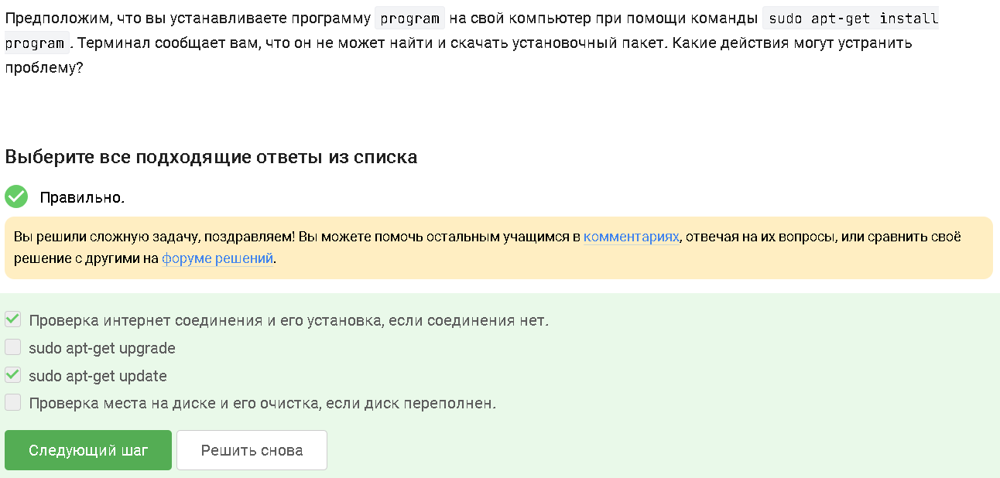

# FileZilla

## Использование FileZilla

Программа FileZilla позволяет копировать файлы между сервером и локальным компьютером,  
просматривать содержимое директорий на обеих сторонах и удобно управлять файлами  
через графический интерфейс поверх протокола FTP/SFTP.

# Графические программы на сервере

## Запуск программ, требующих экран

Если программе нужен графический интерфейс, можно:  
проверить, существует ли консольная версия этой программы,  
или настроить сервер на поддержку вывода на удалённый экран (X11‑forwarding и т.п.).  

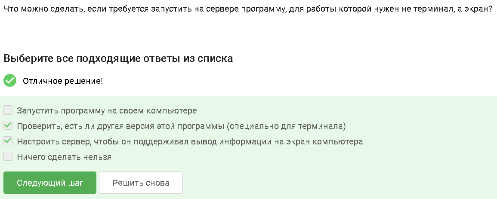

# Справка по программам

## Получение справки

Справочную информацию о программе обычно можно получить командами:  
`program --help`, `-h`, `man program`, а также встроенной `help program` для некоторых оболочек.  
Это позволяет понять доступные опции и режимы работы.

# Биоинформатические утилиты

## FastQC

Программа FastQC может принимать на вход файлы форматов `fastq`, `bam`, `sam`,  
включая выровненные (`*_mapped`) и невыравненные данные.  
Она используется для контроля качества секвенированных данных.

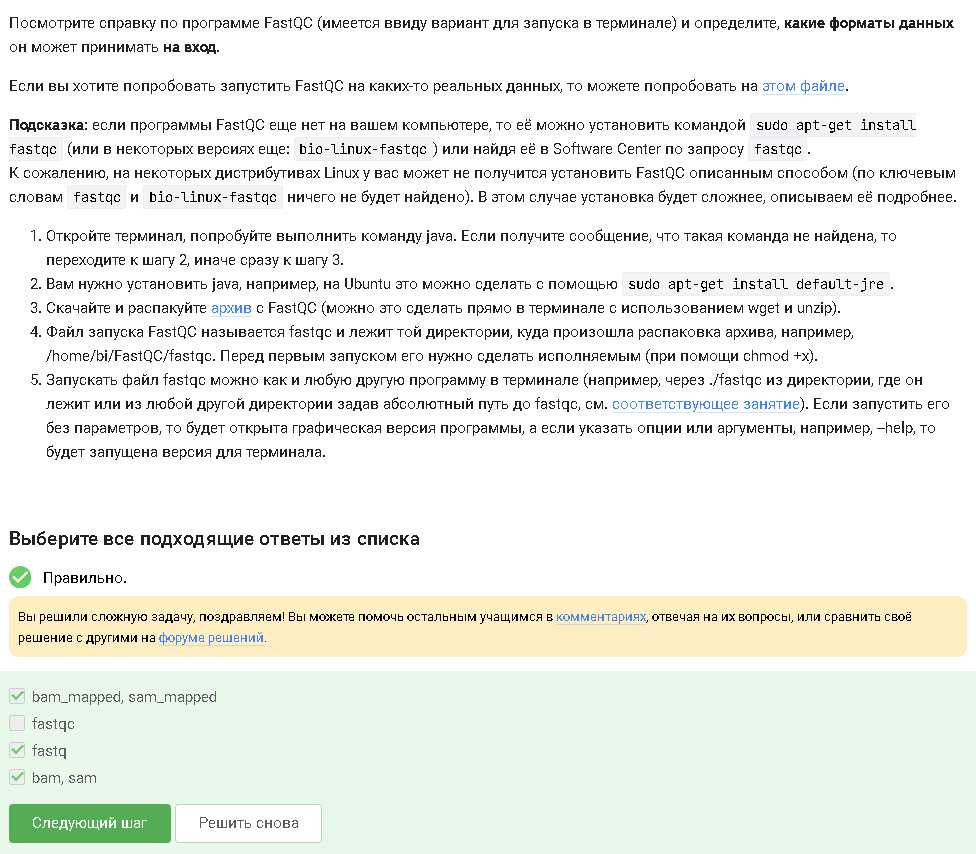

## ClustalW

Команда `clustalw test.fasta -align` запускает ClustalW на файле `test.fasta`  
и выполняет множественное выравнивание последовательностей (multiple alignment).  
Результат используется для анализа сходства и различий между последовательностями.

# Управление заданиями

## Команда jobs

Команда `jobs` показывает фоновые и остановленные задания в текущем shell.  
В примере информация отображается только о `program2` и `program3`:  
одна остановлена (Stopped), другая работает (Running).

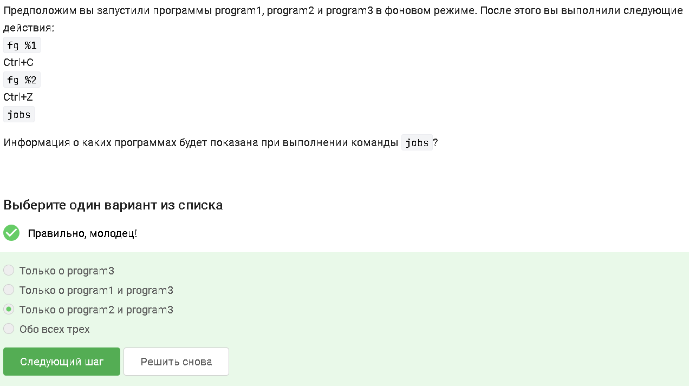

## PID и job ID

`jobs` показывает job ID (например, `%1`, `%2`),  
которые относятся только к текущему shell.  
`ps` и `top` отображают PID — реальные идентификаторы процессов в системе,  
поэтому именно у них идентификаторы совпадают.

# Завершение процессов

## kill -9

Команда `kill -9` посылает сигнал SIGKILL и мгновенно завершает процесс,  
в том числе остановленный.  
Этот сигнал нельзя перехватить или проигнорировать, поэтому использовать его нужно осторожно.

## Обычный kill

Если использовать `kill` без опций по отношению к процессу, остановленному `Ctrl+Z`,  
процесс начнёт завершаться, как только будет возобновлён.  
Это демонстрирует разницу между мягким и жёстким завершением.

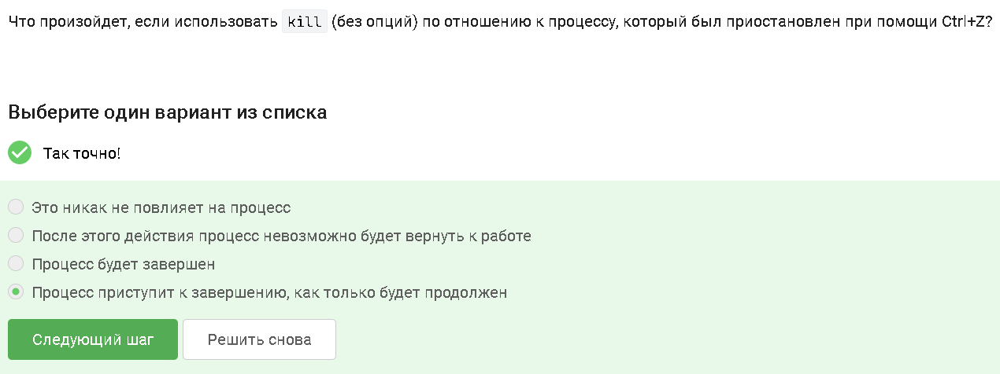

# Многопоточные приложения

## Использование CPU

Остановленное по `Ctrl+Z` многопоточное приложение использует 0% CPU,  
так как его выполнение приостановлено.  
Однако оно остаётся в памяти и может быть возобновлено.

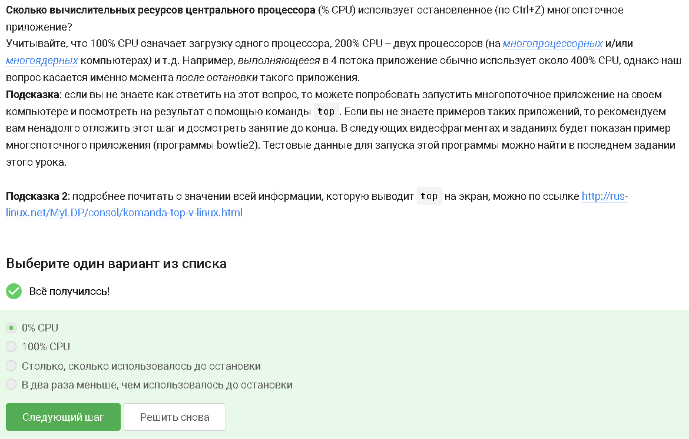

## Использование памяти

Многопоточное приложение занимает столько памяти,
сколько потребляло на момент остановки.
Состояние сохраняется, чтобы можно было продолжить работу, а не запускать заново.

## Завершение отдельных потоков

Невозможно принудительно завершить один из потоков многопоточного приложения
стандартными средствами управления процессами.
Обычно управление потоками реализуется внутри самой программы.

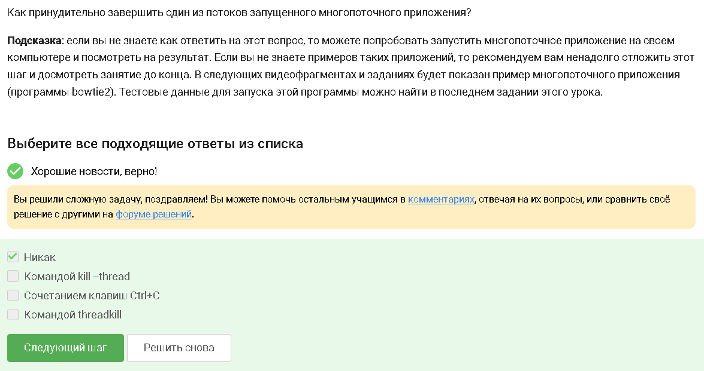

# bowtie2

## Многопоточность bowtie2

Из рассмотренных программ только 'bowtie2' можно выполнять в несколько потоков,
используя соответствующие опции.
Это позволяет ускорить выравнивание больших объемов данных.

## Порядок действий с bowtie2

В ходе работы был выполнен следующий порядок действий:
скачивание архива с программой, распаковка , переход в каталог,
загрузка файлов 'reference.fasta' и 'reads.fastq.gz', распаковка,
запуск 'bowtie2-build' для создания индекса и запуск 'bowtie2' для выравнивания.
Логи и ошибки перенаправились в файлы 'bowtie.log' и 'bowtie.err'.

# tmux

## fg во второй вкладке

При переключении во вторую вкладку tmux и вводе 'fg'
терминал сообщает, что нет процесса для запуска в foreground,
так как задания привязаны к конкретной сессии/вкладке.

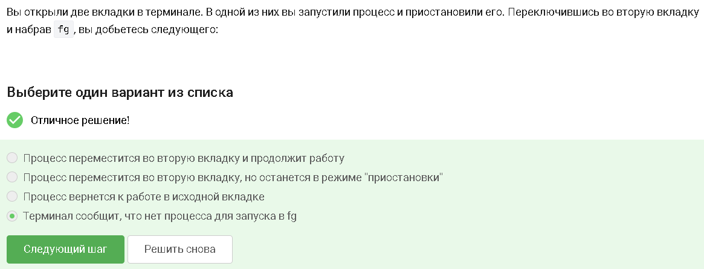

## Завершение tmux

Если в одной из вкладок tmux выполнить команду 'exit', 
tmux завершит работу, если это была последняя активная оболочка.

## Разрыв соединения и работа tmux

Если закрыть терминал, соединение с сервером прервется,
но сессия tmux продолжит работать на сервере. 
К ней можно будет переподключиться позже.

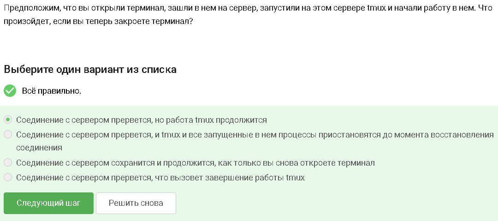

## Закрытие вкладки tmux

Если запустить процесс в фоновом режиме в одной из вкладок tmux  
и принудительно закрыть эту вкладку (`Ctrl+B`, `X`),  
то вместе с вкладкой завершится и запущенный в ней процесс.

## Переименование вкладки

Комбинация `Ctrl+B` и `,` (запятая) используется для переименования текущей вкладки tmux,  
что упрощает навигацию между несколькими задачами.

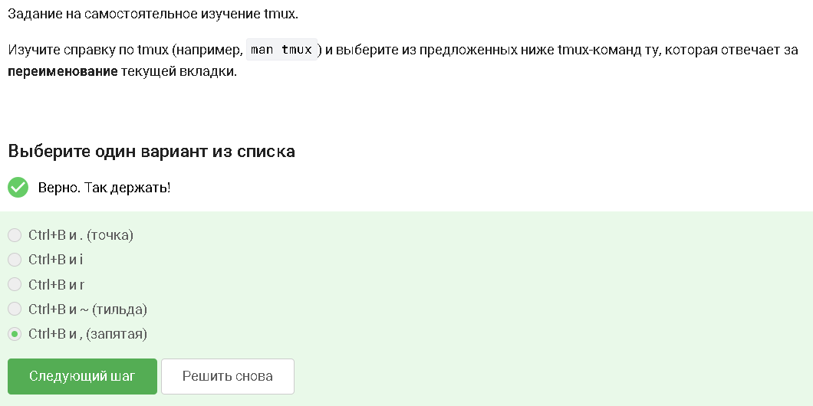

## Разделение окна tmux

Команды разделения действуют только в текущей вкладке tmux.  
Можно разделить окно горизонтально и вертикально,  
перемещаться между панелями с помощью `Ctrl+B` и стрелок,  
закрывать отдельные панели (`Ctrl+B`, `x`)  
и комбинировать несколько уровней разделения.

# Вывод

В ходе работы были получены практические навыки работы на удаленном сервере:
подключение по SSH, копирование файлов, управление процессами и многопоточными приложениями, 
использование биоинформатических утилит и терминального мультиплексора tmux.
Эти навыки являются важной основой для дальнейшей работы с серверными системами.
