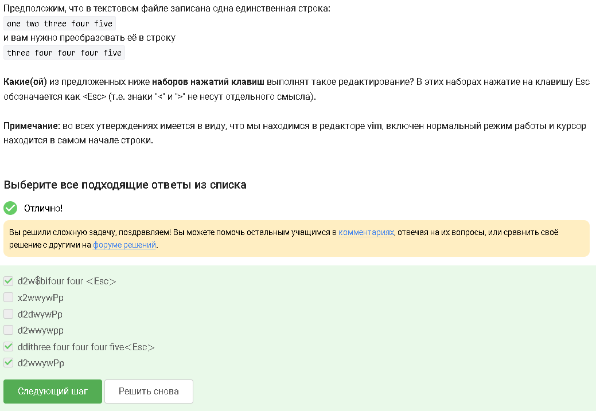
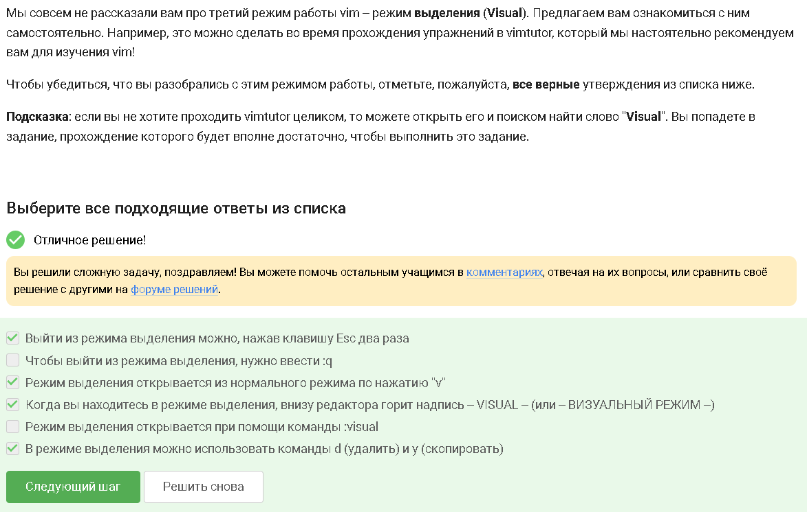
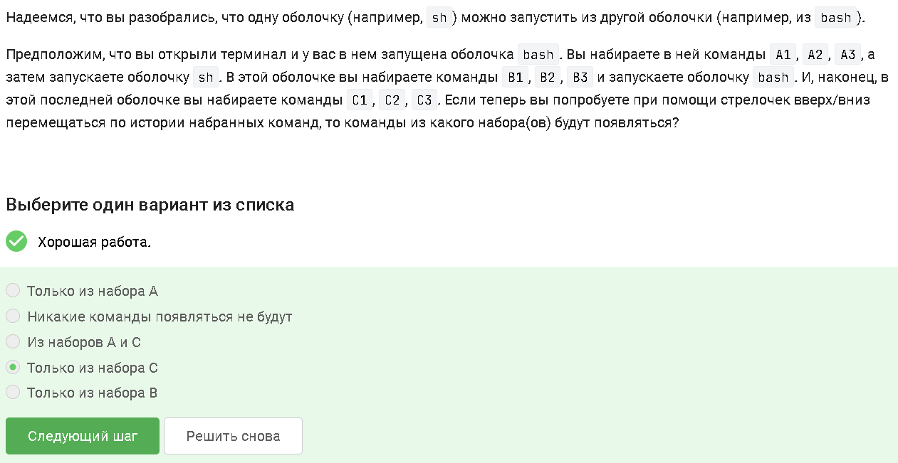
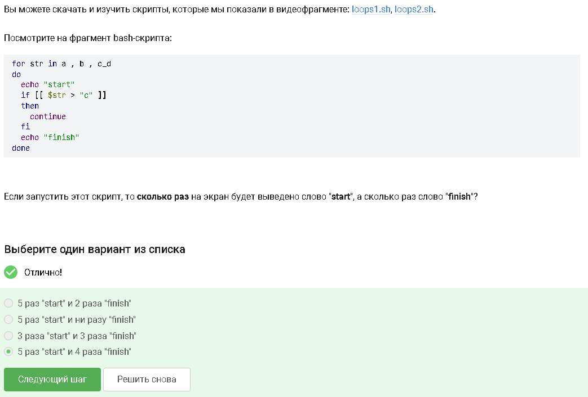
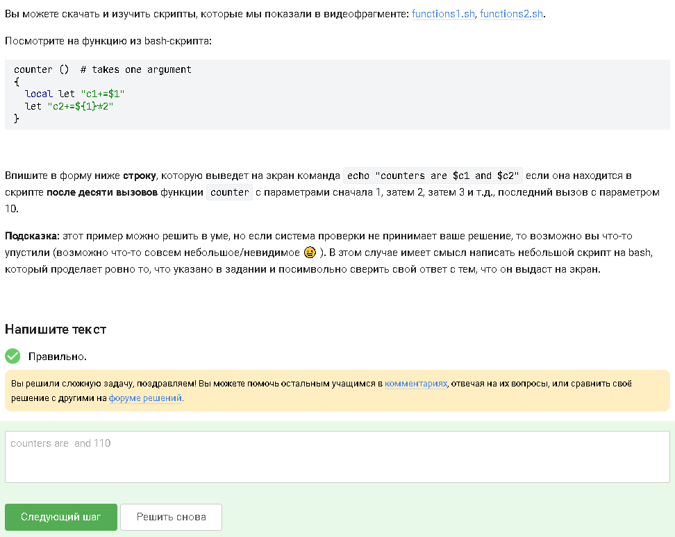
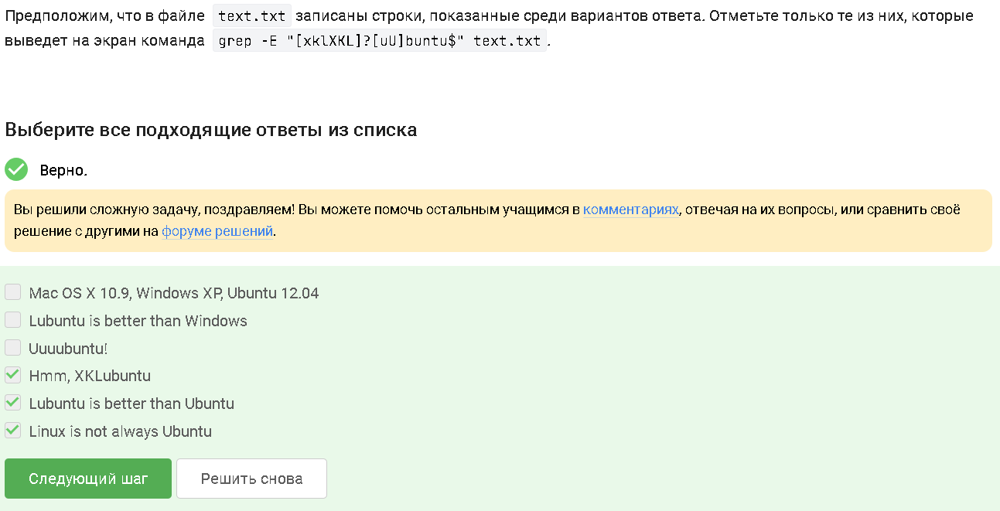
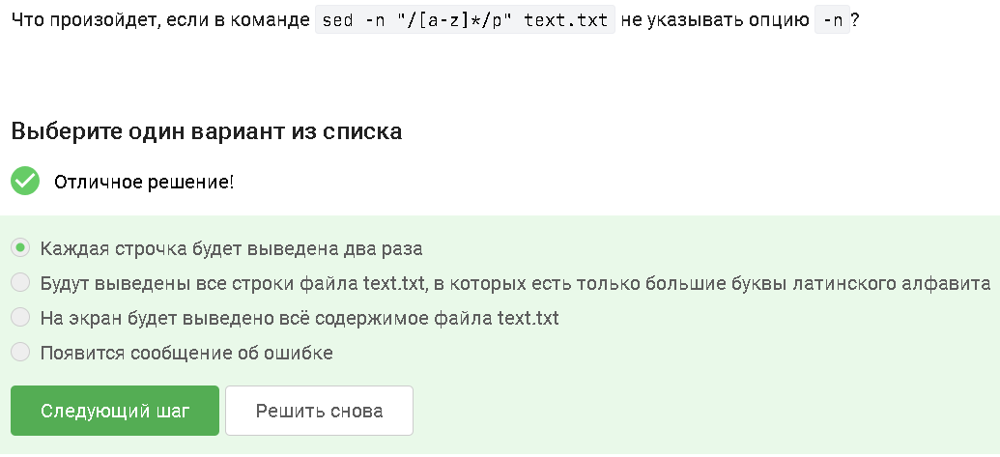
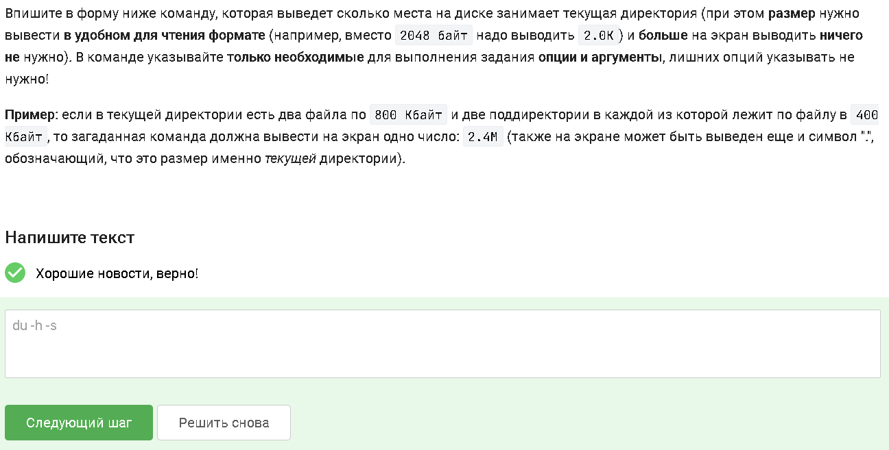
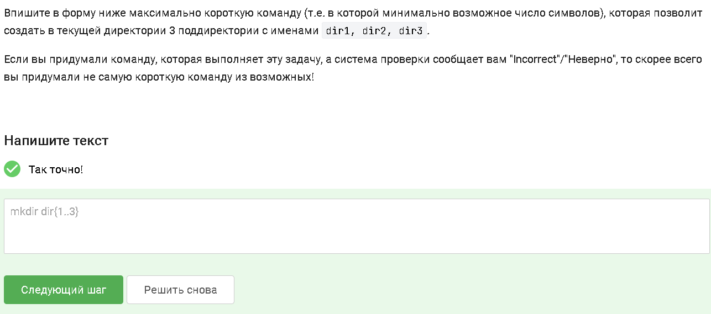

---
author:
  name: Кара Егор Андреевич
  degrees: student
  email: 1032253851@rudn.ru
  affiliation:
    - name: Российский университет дружбы народов
      country: Российская Федерация
      postal-code: 117198
      city: Москва
      address: ул. Миклухо-Маклая, д. 6

title: "Операционные системы"
subtitle: "Внешний курс. Работа с vim, bash, sed, find, gnuplot"
date: today
date-format: "2026-01-05"

format:
  revealjs:
    theme: beige
    slide-number: true
    transition: fade
    center: true
    width: 1280
    height: 720
  beamer:
    theme: metropolis
    slide-level: 2
---

# Информация

## Докладчик

:::::::::::::: {.columns align=center}
::: {.column width="70%"}

* Кара Егор Андреевич  
* НБИбд‑01‑25, студент  
* Российский университет дружбы народов им. П. Лумумбы  
* 1032253851@rudn.ru  

:::
::: {.column width="30%"}

:::
::::::::::::::

# Цель работы

Целью работы является освоение продвинутых инструментов Linux:  
редактора vim, написания bash‑скриптов, работы с условиями и циклами,  
использования sed и grep, поиска файлов через find,  
а также построения графиков в gnuplot.

# vim

## Перемещение по словам

Команды `w` и `W` перемещают курсор по словам, но учитывают разделители по‑разному.  
После 10 нажатий на `W` курсор окажется в том же месте, что и после 10 нажатий `w`,  
если текст не содержит специальных символов.

## Комбинации для редактирования

Команды `d2w$bifour<Esc>`, `ddithree four four four five<Esc>` и `d2wwywPp`  
выполняют корректное редактирование текста, используя удаление, вставку и копирование.  
Это демонстрирует сочетание нормального, вставочного и операторного режимов vim.

## Замена слов в файле

Команда `:%s/Windows/Linux/` заменяет первое вхождение слова Windows  
в каждой строке файла на Linux.  
Это пример глобальной замены с ограничением на одно совпадение в строке.

## Visual‑режим

Режим выделения открывается клавишей `v`,  
внизу появляется надпись `-- VISUAL --`.  
В этом режиме можно удалять (`d`) и копировать (`y`) выделенный текст.  
Выход — дважды нажать `Esc`.

# Процессы и оболочки

## История команд

При запуске нового shell создаётся новый процесс.  
История команд хранится отдельно для каждого процесса,  
поэтому при перемещении стрелками вверх/вниз отображаются только команды текущего shell.

# bash‑скрипты

## Абсолютный путь

После выполнения скрипта файл `file1.txt` окажется в `/home/bi/file1.txt`,  
так как он создаётся в домашней директории перед переходом в Desktop.

## Имена переменных

Корректные имена переменных:  
`__variable`, `VARiable`, `variable123`, `_variable`, `variable_123`.  
Имя не может начинаться с цифры.

## Скрипт с аргументами

Скрипт принимает два аргумента и выводит их значения.  
Важно экранировать `$` внутри строки, чтобы избежать подстановки.

# Условия в bash

## Условия, всегда возвращающие True

Примеры выражений, которые всегда истинны:  
`$var1 == $var2 || $var1 != $var2`,  
`$# -ge 0`,  
`-e $0`,  
`5 -ge 5`,  
`-z ""`.

## Логика условий

В примере со значениями `var=3` и `var=5`  
ни одно условие не выполняется, поэтому выводится `"four"` в обоих случаях.

## Скрипт о количестве студентов

Скрипт корректно обрабатывает диапазоны значений:  
1 студент, 2–4 студента, 5 и более — "A lot of students".

## Циклы

Скрипт выводит 5 раз `"start"` и 4 раза `"finish"`,  
так как `finish` печатается после итерации цикла.

## Определение возрастной группы

Скрипт использует вложенные условия для классификации возраста.  
Это пример структурированного ветвления.

.PNG)

# Арифметика и функции

## Увеличение переменной

Команды, увеличивающие `a` на значение `b`, используют  
`let`, `(( ))`, или `a=$((a+b))`.

## Работа функций

После 10 вызовов функции `counter`  
переменная `c1` пуста, а `c2` равна 110 — удвоенной сумме 1..10.

## НОД двух чисел

Реализация алгоритма Евклида в bash  
позволяет вычислить наибольший общий делитель.

.PNG)

## Калькулятор

Скрипт выполняет арифметические операции,  
используя конструкцию `case`.

.PNG)

# grep, sed, find

## Поиск файлов

Команда `find -iname "star*"` найдёт файлы независимо от регистра,  
в отличие от `-name`.

## Регулярные выражения

Команда `grep -E "[xklXKL]?[uU]buntu$"`  
находит строки, оканчивающиеся на Ubuntu с необязательным префиксом.

## sed

Без `-n` sed выводит строки дважды:  
оригинал + результат обработки.

## Замена аббревиатур

Команда sed заменяет все аббревиатуры на слово `"abbreviation"`  
и записывает результат в `edited.txt`.

.PNG)

# gnuplot

## Опция persist

Флаг `-p` сохраняет графики после выхода из gnuplot.

## Построение графиков

Название ряда — первое значение второго столбца,  
точек — 9, так как первая строка пропущена.

## Изменение move.rot

Изменены инструкции для:  
— зеркального отражения по оси Z,  
— обратного направления вращения,  
— удвоения скорости.

.PNG)

# Права доступа

## chmod и chown

Команды позволяют установить права `rwxrw-r--`  
и объясняют, почему пользователь из группы всё ещё может создавать файлы.

.PNG)

## wc

Команда `wc` считает строки, слова, байты и символы.

## Размер директории

Команда `du -sh .` выводит размер текущей директории  
в удобном формате.

## Создание директорий

Минимальная команда для создания `dir1`, `dir2`, `dir3`:  
`mkdir dir{1..3}`.

# Вывод

В ходе работы были освоены продвинутые инструменты Linux:  
vim, bash‑скрипты, условия и циклы, sed, grep, find, gnuplot.  
Получены навыки, необходимые для автоматизации, анализа данных  
и эффективной работы в терминале.

