---
## Author
author:
  name: Кара Егор Андреевич
  email: 1032253851@rudn.ru
  affiliation:
    - name: Российский университет дружбы народов
      country: Российская Федерация
      postal-code: 117198
      city: Москва
      address: ул. Миклухо-Маклая, д. 6

## Title
title: "Операционные системы"
subtitle: "Внешний курс. Введение в Linux"
---

# Цель работы

Ознакомление с Linux, получение базовых навыков работы с Linux.

# Выполнение внешнего курса.

## Название курса - "Введение в Linux".

{#fig-001 width=100% height=40%}

## Отметил все верные утверждения, связанными с успешным прохождением курса.

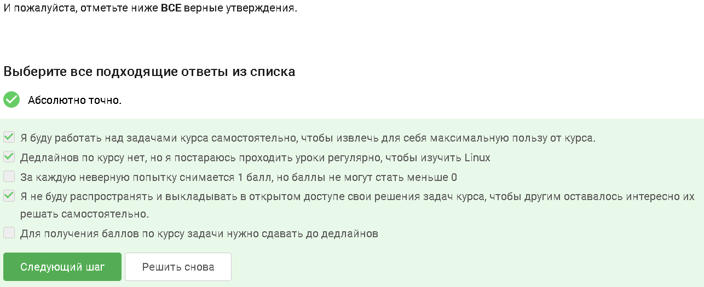{#fig-002 width=100% height=10%}

## Windows - операционная система, которую я обычно использую. 

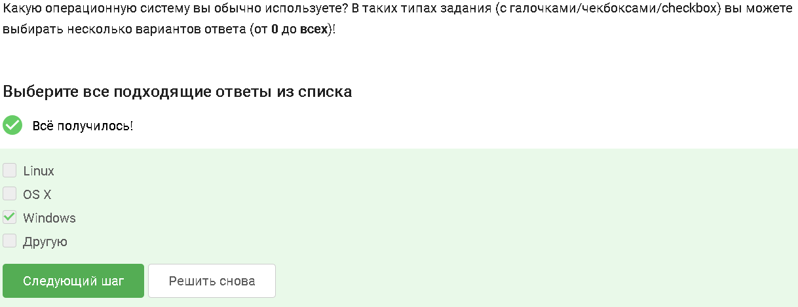{#fig-003 width=100% height=15%}

## По определению, виртуальная машина - специальная программа для запуска одной ОС на другой ОС.

{#fig-004 width=100% height=15%}

## Я смог запустить Linux на своем компьютере.

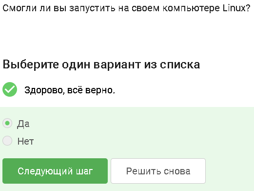{#fig-005 width=100% height=10%}

## Создал документ в LibreOffice Writer и написал в нём шрифтом FreeMono одну-единственную строчку: Hello, Linux!

.PNG){#fig-006 width=100% height=10%}

.PNG){#fig-007 width=100% height=10%}

## Расширение deb имеет установочные пакеты в Linux (Ubuntu). Пакет .deb представляет собой архив, который содержит скомпелированный код самой программы, файлы конфигурации, инструкции для пакетного менеджера.

{#fig-008 width=100% height=10%}

## Я поставил себе в систему плеер VLC, запустил, открыл Help → About (или Shift+F1) и написал ниже первую фамилию (без имени!) из вкладки Authors. Эта фамилия была "Denis-Courmont".

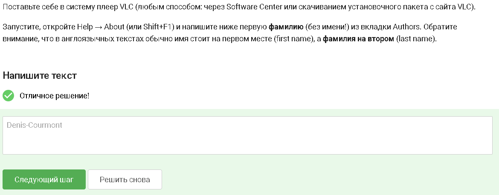{#fig-009 width=100% height=10%}

## Приложение Update Manager можно использовать для обновления установленных программ, ссылок в Software Center, всей системы до новой версии. Приложение не подходит для удаления установленных программ и установки новых программ.

{#fig-010 width=100% height=10%}

## Cинонимы для “командной строки”: консоль и терминал. Ассоль и термин не относятся к понятию командной строки.

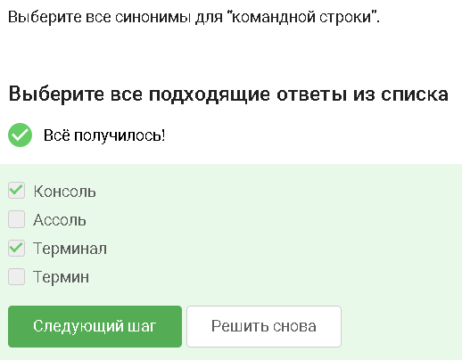{#fig-011 width=100% height=10%}

## pwd - команда, которая напечатает в какой директории мы сейчас находимся. Linux в отличие от Windows чувствительный к регистру, и символы PWD и pwd по сути разные.

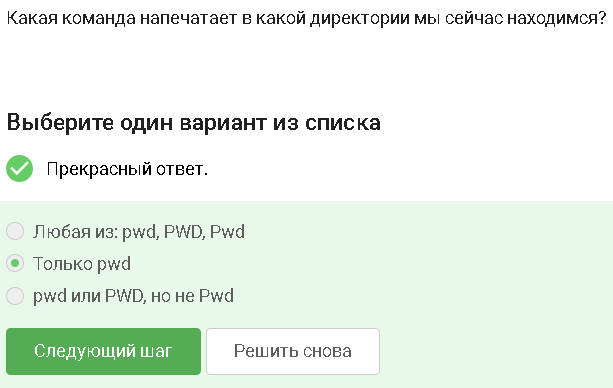{#fig-012 width=100% height=10%}

## Все команды со скриншота полностью эквивалентны команде ls -A --human-readable -l /some/directory, так как все опции корректны и соответствуют исходной команде.

{#fig-013 width=100% height=50%}

## Команды, корректно выполняют задачу — `ls ~/Downloads`, `ls ../Downloads`, и `ls /home/bi/Downloads`. Команда `ls /home/bi/Do*` выводит содержимое других директорий.

{#fig-014 width=100% height=50%}

## `rm -r`

*   `rm`: Команда для удаления.
*   `-r` (recursive): Этот флаг означает "рекурсивно". Когда вы используете `rm -r` с директорией, команда делает следующее:
    1. Сначала удаляет все файлы внутри этой директории.
    2. Затем удаляет все поддиректории внутри нее (и так далее, рекурсивно, пока не дойдет до самого вложенного уровня).
    3. Наконец, удаляет саму директорию, когда она становится пустой.

    Комбинация с `-f`: Часто используется `rm -rf` (рекурсивно и принудительно). Это мощная комбинация, которая удаляет директорию и все ее содержимое без каких-либо запросов. Используйте ее с крайней осторожностью! Ошибки в написании команды `rm -rf` могут привести к потере важных данных.

Почему подходит:
Флаг `-r` специально добавлен для того, чтобы команда `rm` могла удалять директории, причем как пустые, так и непустые (вместе с их содержимым).

{#fig-015 width=100% height=50%}

## В Ubuntu 20.04 ничего не закроется до тех пор пока работает firefox. Как только браузер будет закрыт (вручную) терминал выполнит команду exit и закроется уже сам терминал.

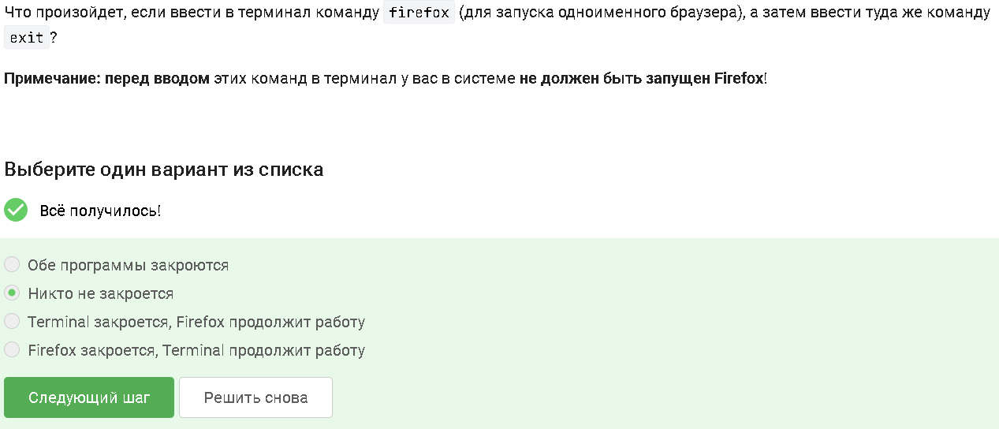{#fig-016 width=100% height=50%}

## Ctrl+Z останавливает, bg - переводит в фоновый режим.

{#fig-017 width=100% height=50%}

## Подробно:

freeunivers@freeunivers-System-Product-Name:~$ cd ~/Загрузки/                   f
freeunivers@freeunivers-System-Product-Name:~/Загрузки$ python3 lec1_frag4_current_time.py
2023-09-14 21:36:23
Control sum: 948

{#fig-018 width=100% height=50%}

## Поток ошибок (stderr или дескриптор 2) из программы, запущенной в терминале, по умолчанию выводится на экран. Хотя ошибки идут в отдельный поток, по умолчанию он направлен в тот же терминал (консоль), что и стандартный вывод (stdout), поэтому пользователь видит их вместе. Правильный ответ из списка: На экран.

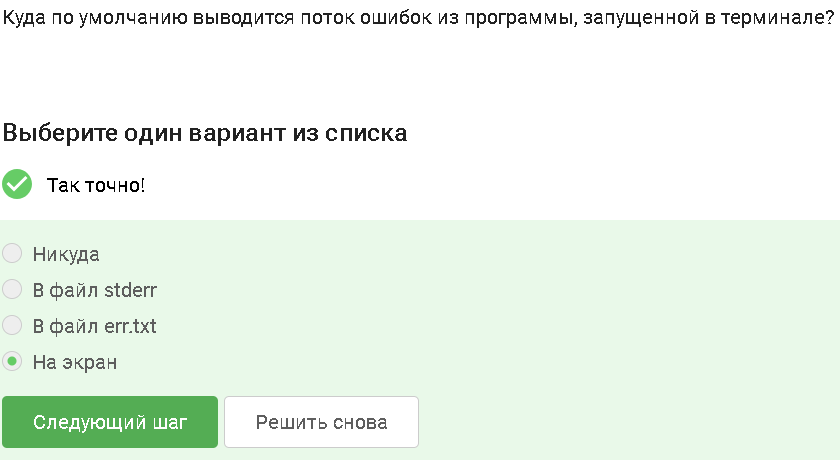{#fig-019 width=100% height=50%}

## Ответы: program 2>> file.txt, program 2> file.txt. Важно различать <  <<  (принять, брать)      >  >> (выводить, отправить, записать, дописать), а также  <1 STIN <2  STOUT <3 STERR и т.д.

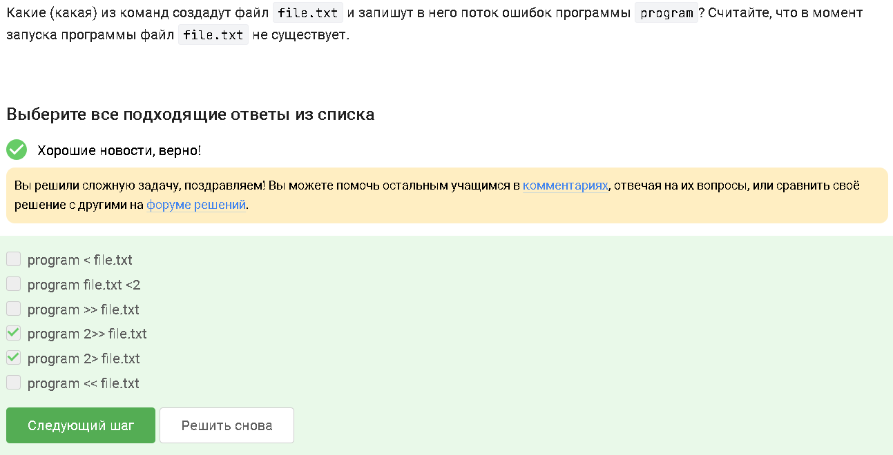{#fig-020 width=100% height=50%}

## При замене less на nano выдается следующее сообщение, без вывода редактора:

Too many errors from stdin

Буфер записан в nano.save

{#fig-021 width=100% height=50%}

## Правильный ответ: "/home/alex/1.jpg"

 1. Сначала командой cd /home/alex/ вы переходите в директорию /home/alex/. Теперь она является текущей рабочей папкой.
 2. Флаг -P (directory prefix) должен указывать папку для загрузки (/home/alex/Pictures). НО, в wget заложено жесткое правило: если в команде используется флаг -O (задать точное имя выходного файла), то флаг -P полностью игнорируется.
 3. Поскольку флагу -O передан просто относительный путь — имя 1.jpg (а не абсолютный, вроде /home/alex/Pictures/1.jpg), утилита скачивает файл под этим именем прямо в текущую рабочую директорию.
В результате картинка окажется там же, откуда запускалась команда wget — то есть в /home/alex/1.jpg.

{#fig-022 width=100% height=50%}

## -q - это отключить вывод wget

{#fig-023 width=100% height=50%}

## Использую ссылку на документацию, переведенную на русский язык: "Наконец, стоит отметить, что списки принятых/отклоненных файлов дважды сверяются с загруженными файлами: сначала с частью имени файла в URL-адресе, чтобы определить, следует ли вообще загружать файл; затем, после того как файл принят и успешно загружен, имя локального файла также проверяется по спискам принятых/отклоненных файлов, чтобы определить, следует ли его удалить. Обоснование заключалось в том, что, поскольку файлы с расширениями «.htm» и «.html» всегда загружаются независимо от правил принятия/отклонения, их следует удалять после загрузки и проверки на наличие ссылок, если они соответствуют спискам принятых/отклоненных файлов."

{#fig-024 width=100% height=50%}

## gzip и zip — это разные инструменты: gzip предназначен для сжатия одного файла (часто в связке с tar), а zip упаковывает множество файлов и папок в один контейнер. Да, по умолчанию gzip удаляет исходный файл после сжатия и архив после распаковки.

{#fig-025 width=100% height=50%}

## Обе программы могут архивировать директории, но работают по-разному: zip — сразу объединяет и сжимает папку.Пример: zip -r archive.zip folder/tar — только объединяет файлы в один архив (без сжатия). Для сжатия добавляют флаг -z (получится .tar.gz).Пример: tar -czvf archive.tar.gz folder/

{#fig-026 width=100% height=50%}

## Ответ: -cjf. c - чтобы заархирвировать, j - для использования имено архиватора bzip, f - потому что создаем архив вфайловой системе

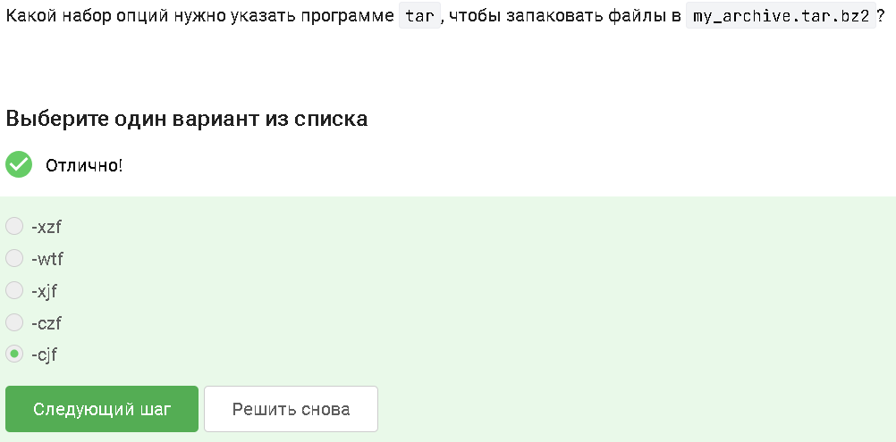{#fig-027 width=100% height=50%}

## alexey.* - потому что алексей с маленькой буквы; *.? - потому что ? обозначает только 1 символ; *.jpg - потому что тип jpg, a не jpeg

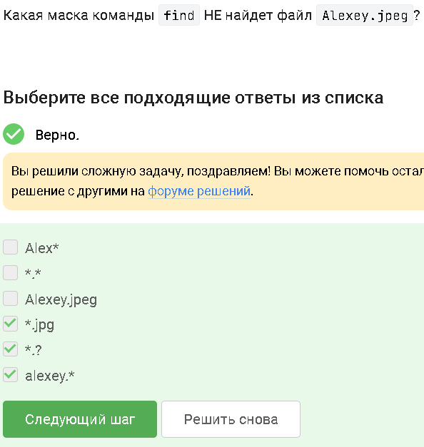{#fig-028 width=100% height=50%}

## ~$ touch text.txt
~$ nano text.txt
-Вставляем строки и сохраняем
~$ grep "world" text.txt

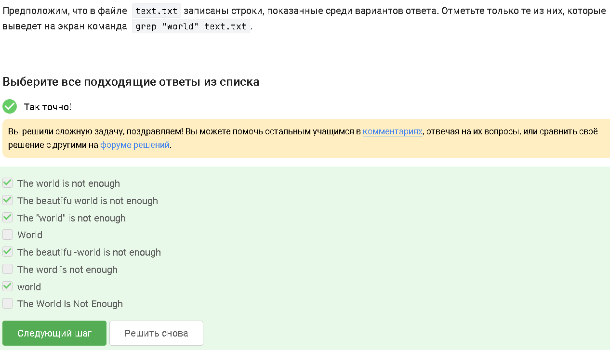{#fig-029 width=100% height=50%}

## Мое решение:

tar -xvf shakespeare.tar.gz
cd Shakespeare
grep -r "love" ./ > result.txt
grep: файл ввода «./result.txt» также используется и для вывода

.PNG){#fig-030 width=100% height=50%}

# Вывод

Ознакомились с Linux, получили базовые навыки работы с Linux.
