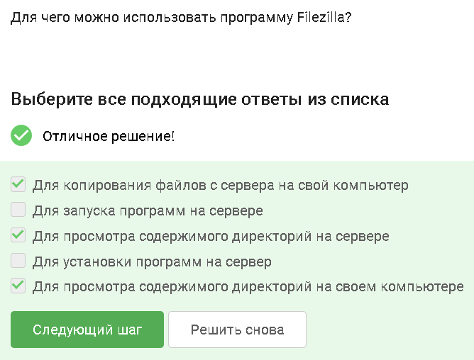
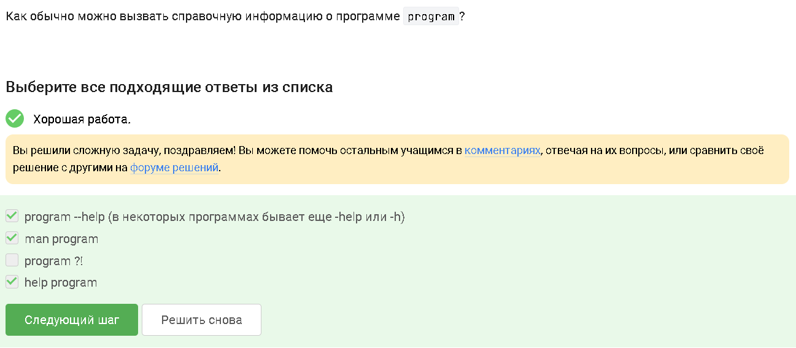
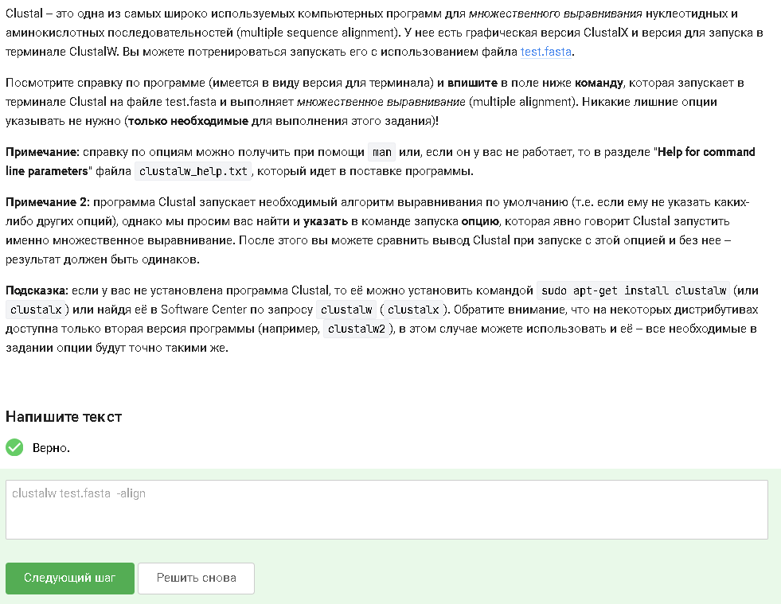
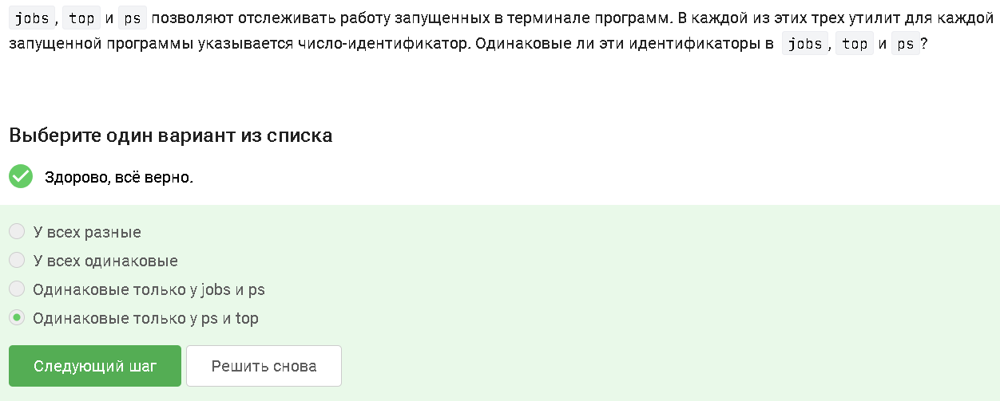
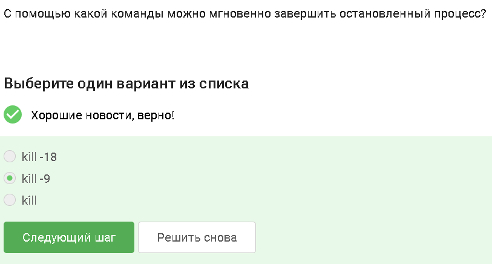
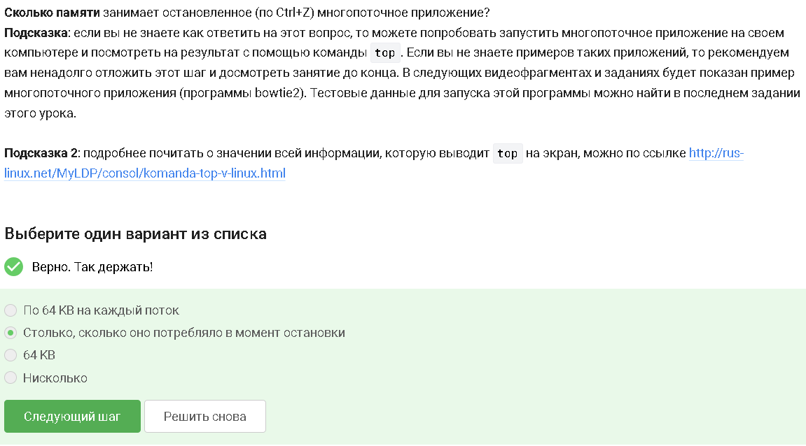
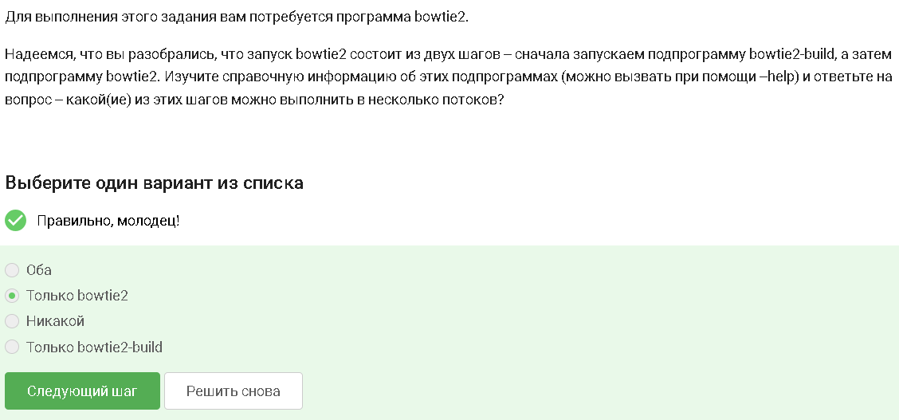
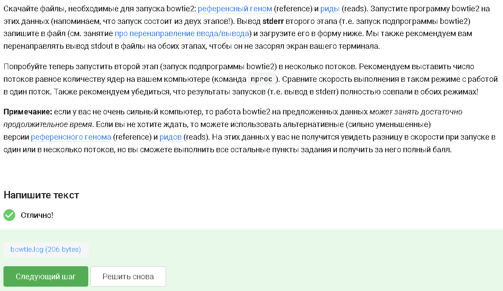
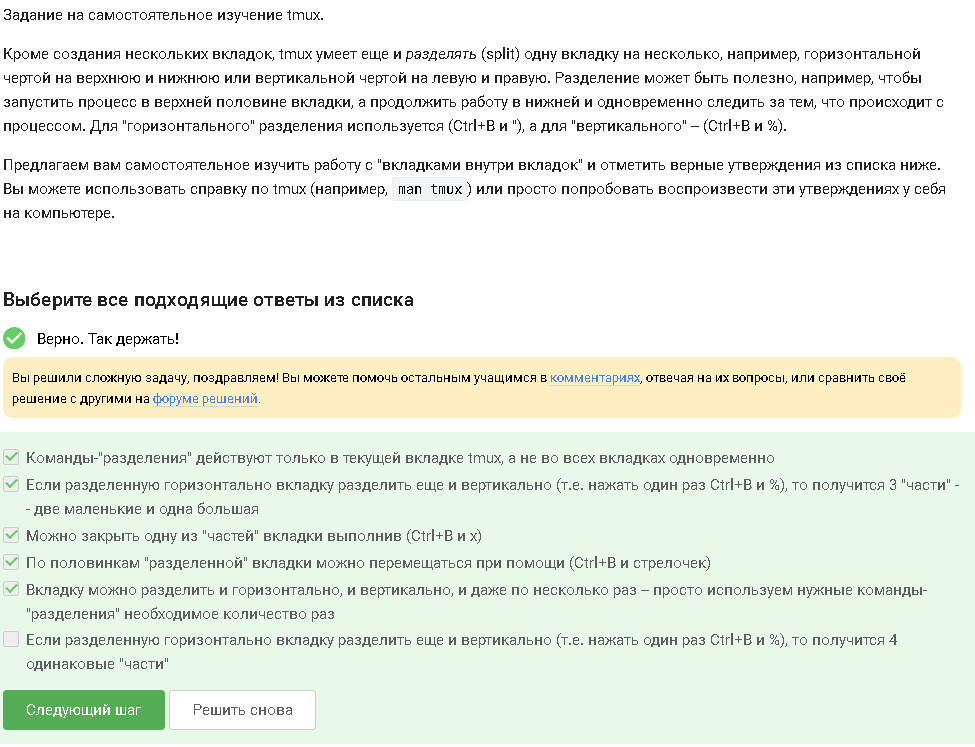

---
## Author
author:
  name: Кара Егор Андреевич
  email: 1032253851@rudn.ru
  affiliation:
    - name: Российский университет дружбы народов
      country: Российская Федерация
      postal-code: 117198
      city: Москва
      address: ул. Миклухо-Маклая, д. 6

## Title
title: "Операционные системы"
subtitle: "Внешний курс. Работа на сервере"
---

# Цель работы

Получение навыков работы на сервере.

# Выполнение внешнего курса.

## Удаленный сервер можно использовать для: хранения больших объемов данных, общедоступных данных (например, доступных для всех пользователей интернета), конфиденциальных данных (т.е. доступ к ним должны иметь только ограниченный круг лиц), выполнения сложных (затратных по памяти и времени) вычислений.

{#fig-001 width=100% height=40%}

## id_rsa.pub - ключ, который можно без опаски пересылать по интернету, так как только он является открытым.

{#fig-002 width=100% height=10%}

## Команда scp -r stepic username@server:~/ скопирует на сервер (в домашнюю директорию) папку stepic вместе с содержимым ее самой и всех ее подпапок.
ssh -cp stepic username@server:~/ — команда ssh не копирует файлы.
scp stepic/* username@server:~/ — копирует только файлы внутри stepic, но не саму папку и не вложенные каталоги.
ssh -cp stepic/* username@server:~/ — снова ssh, не подходит.

{#fig-003 width=100% height=15%}

## Проверка интернет соединения и его установка, если соединения нет и sudo apt-get update могут устранить проблему.
Команда apt update используется для синхронизации списков пакетов в вашей системе. Она извлекает последние списки пакетов PPA и репозиториев в вашей системе и обеспечивает их актуальность. Команда apt upgrade обновляет пакеты до последних версий и устанавливает новые пакеты, если они требуются в качестве зависимостей. Он не удаляет никакие пакеты, а если какие-либо из них предназначены для удаления, он их пропускает.

{#fig-004 width=100% height=15%}

## Программу Filezilla можно использовать для: копирования файлов с сервера на свой компьютер, просмотра содержимого директорий на сервере и на своем компьютере.

{#fig-005 width=100% height=10%}

## Если требуется запустить на сервере программу, для работы которой нужен не терминал, а экран, можно проверить, есть ли другая версия этой программы (специально для терминала); настроить сервер, чтобы он поддерживал вывод информации на экран компьютера

{#fig-006 width=100% height=10%}

## Cправочную информацию о программе program обычно можно вызвать с помощью: program --help (в некоторых программах бывает еще -help или -h), man program, help program.

{#fig-007 width=100% height=10%}

## Программа FastQC может принимать на вход: bam_mapped, sam_mapped; fastq; bam, sam.

{#fig-008 width=100% height=10%}

## clustalw test.fasta  -align - команда, которая запускает в терминале Clustal на файле test.fasta и выполняет множественное выравнивание (multiple alignment)

{#fig-009 width=100% height=10%}

## Информация только о program2 и program3 будет показана при выполнении команды jobs. 
В jobs будут отображаться: program2 — остановлена (Stopped), program3 — работает (Running).

{#fig-010 width=100% height=10%}

## Эти идентификаторы в jobs, top и ps одинаковые только у ps и top. 
jobs показывает job ID — это локальный номер задания в текущем shell.
Примеры: %1, %2, %3.
Эти номера не имеют отношения к PID процессов в системе.
ps показывает PID — настоящий идентификатор процесса в системе.
top тоже показывает PID, потому что он работает с системными процессами.

{#fig-011 width=100% height=10%}

## С помощью команды kill -9 можно мгновенно завершить остановленный процесс.

{#fig-012 width=100% height=50%}

## Если использовать kill (без опций) по отношению к процессу, который был приостановлен при помощи Ctrl+Z, то процесс приступит к завершению, как только будет продолжен.

{#fig-013 width=100% height=50%}

## 0% CPU вычислительных ресурсов центрального процессора (% CPU) использует остановленное (по Ctrl+Z) многопоточное приложение.

{#fig-014 width=100% height=50%}

## Многопоточное приложение занимает памяти столько, сколько оно потребляло в момент остановки.
Приложение остановленное сохраняет своё состояние, значит оно и остаётся в памяти. Иначе б невозможно было возобновить работу приложения, а можно было б только запустить заново, "с чистого листа".

{#fig-015 width=100% height=50%}

## Невозможно принудительно завершить один из потоков запущенного многопоточного приложения. 

{#fig-016 width=100% height=50%}

## Только bowtie2 можно выполнить в несколько потоков.

{#fig-017 width=100% height=50%}

## Порядок действий:
1 Скачал файл с программой в самом начале модуля
2 cd ./Загрузки - зашел в папку
3 unzip bowtie2-2.1.0-linux-x86_64.zip - распаковал архив с программой
4 ls - проверил всели в порядке с распаковкой
5 cd ./bowtie2-2.1.0/ - зашел в папку с программой
6 wget -P ./bowtie2-2.1.0/ https://stepik.org/media/attachments/course73/reference.fasta - скачал первый доп файл
7 wget -P ./bowtie2-2.1.0/ https://stepik.org/media/attachments/course73/reads.fastq.gz - скачал доп архив
8 gunzip ./bowtie2-2.1.0/reads.fastq.gz - распаковыал архив
9 ./bowtie2-2.1.0/bowtie2-build ./bowtie2-2.1.0/reference.fasta index >> ./bowtie2-2.1.0/bowtie.log 2>> ./bowtie2-2.1.0/bowtie.err - из папки Загрузки запустил программу №1
10 -p 4 ./bowtie2-2.1.0/bowtie2 -x index -U ./bowtie2-2.1.0/reads.fastq >> ./bowtie2-2.1.0/bowtie.log 2>> ./bowtie2-2.1.0/bowtie.err - запустил программу №2 (ксати , ключ -р 4, у меня не сработал((( )
11 Загрузил файл с ошибками

{#fig-018 width=100% height=50%}

## Переключившись во вторую вкладку и набрав fg, терминал сообщит, что нет процесса для запуска в fg.

{#fig-019 width=100% height=50%}

## Если я введу в этой вкладке в командную строку команду exit, то tmux завершит работу.

{#fig-020 width=100% height=50%}

## Если я теперь закрою терминал, соединение с сервером прервется, но работа tmux продолжится.

{#fig-021 width=100% height=50%}

## Если запустить процесс в фоновом режиме в одной из вкладок tmux, а затем принудительно закрыть эту вкладку (Ctrl+B, X), вкладка закроется, а вместе с ней пропадет и запущенный в ней процесс.

{#fig-022 width=100% height=50%}

## Ctrl+B и , (запятая) - команда, которая отвечает за переименование текущей вкладки.

{#fig-023 width=100% height=50%}

## После проверки через tmux выяснил, что:
Команды-"разделения" действуют только в текущей вкладке tmux, а не во всех вкладках одновременно.
Если разделенную горизонтально вкладку разделить еще и вертикально (т.е. нажать один раз Ctrl+B и %), то получится 3 "части" -- две маленькие и одна большая.
Можно закрыть одну из "частей" вкладки выполнив (Ctrl+B и x).
По половинкам "разделенной" вкладки можно перемещаться при помощи (Ctrl+B и стрелочек).
Вкладку можно разделить и горизонтально, и вертикально, и даже по несколько раз -- просто используем нужные команды-"разделения" необходимое количество раз.

{#fig-024 width=100% height=50%}

# Вывод

Получили навыки работы на сервере.
