---
## Author
author:
  name: Кара Егор Андреевич
  email: 1032253851@rudn.ru
  affiliation:
    - name: Российский университет дружбы народов
      country: Российская Федерация
      postal-code: 117198
      city: Москва
      address: ул. Миклухо-Маклая, д. 6

## Title
title: "Операционные системы"
subtitle: "Внешний курс. Введение в Linux. Продвинутые темы."
---

# Цель работы

Ознакомление с Linux на более продвинутом уровне, получение более сложных навыков работы с Linux.

# Выполнение внешнего курса.

## Нужно нажать " : ", затем "q", затем "Еnter" на клавиатуре, чтобы выйти из редактора vim. 

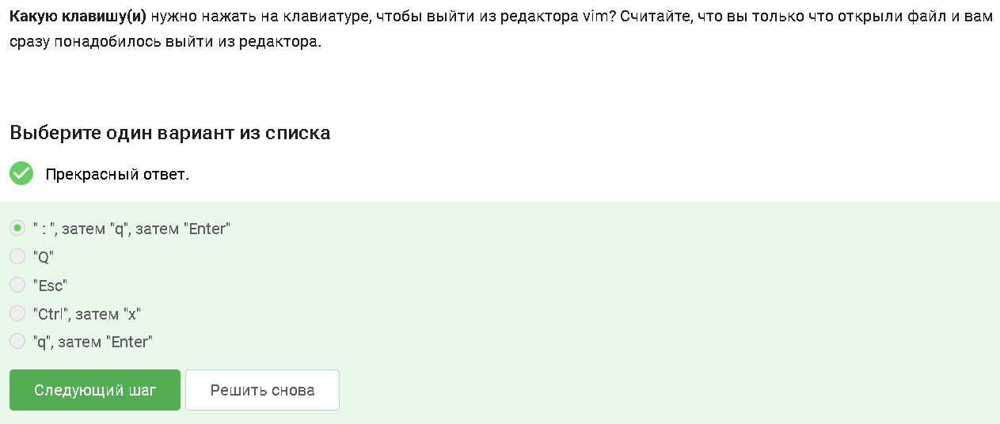{#fig-001 width=100% height=40%}

## Создаем файл и вписываем туда "Strange_  TEXT  is_here. 2=2 YES!". Только это утверждение верно: "После 10 нажатий на W курсор окажется там же, где бы он был после 10 нажатий на w".

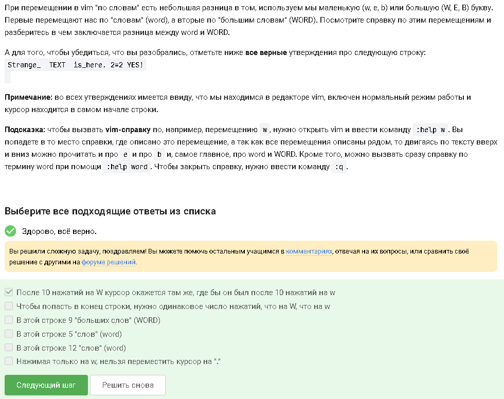{#fig-002 width=100% height=10%}

## Из предложенных ниже наборов нажатий клавиш d2w$bifour four <Esc>, ddithree four four four five<Esc>, d2wwywPp выполнят такое редактирование.

{#fig-003 width=100% height=15%}

## Задача: "Предположим, что вы открыли файл в редакторе vim и хотите заменить в этом файле все строки, содержащие слово Windows, на такие же строки, но со словом Linux. Если в какой-то строке слово Windows встречается больше, чем один раз, то заменить на Linux в этой строке нужно только самое первое из этих слов."

Для этого в vim нужно ввести :%s/Windows/Linux/

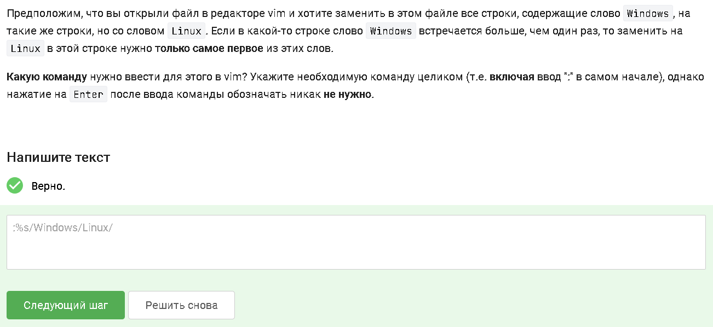{#fig-004 width=100% height=15%}

## Все верные утверждения, которые относятся к третьему режиму работы vim -- режим выделения (Visual):

Выйти из режима выделения можно, нажав клавишу Esc два раза.

Режим выделения открывается из нормального режима по нажатию "v".

Когда вы находитесь в режиме выделения, внизу редактора горит надпись -- VISUAL -- (или -- ВИЗУАЛЬНЫЙ РЕЖИМ --).

В режиме выделения можно использовать команды d (удалить) и y (скопировать).

{#fig-005 width=100% height=10%}

## Если попробовать при помощи стрелочек вверх/вниз перемещаться по истории набранных команд, то команды только из набора С будут появляться.

Каждый вызов любой программы (в том числе терминала) порождает новый процесс. 1ый bash является родительским процессом для вызванного sh, а sh является родителем 2ого процесса bash. Таким образом, запущено два процесса bash, и мы сейчас находимся во втором.

{#fig-006 width=100% height=10%}

## Абсолютный путь до созданного файла file1.txt по окончанию работы скрипта будет выглядеть как /home/bi/file1.txt, так как сначала мы оказывается дома /home/bi, затем создаём file1.txt, затем уходим в ./Desktop.

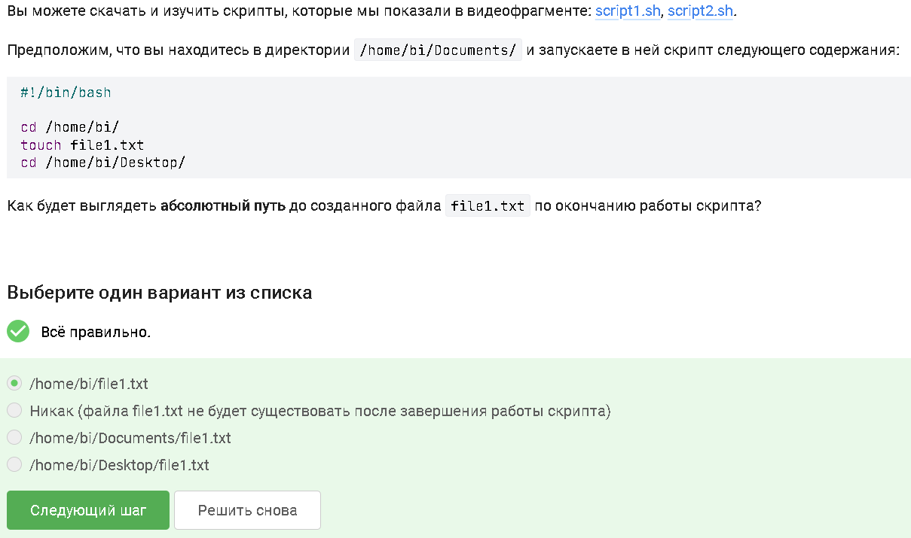{#fig-007 width=100% height=10%}

## Из представленных ниже строк __variable, VARiable, variable123, _variable, variable_123 могут быть именами переменных в bash. Имена переменных всегда могут содержать латинские буквы (любого регистра), знак подчеркивания _ , и цифры (но при условии, что имя переменной не начинается с цифры)

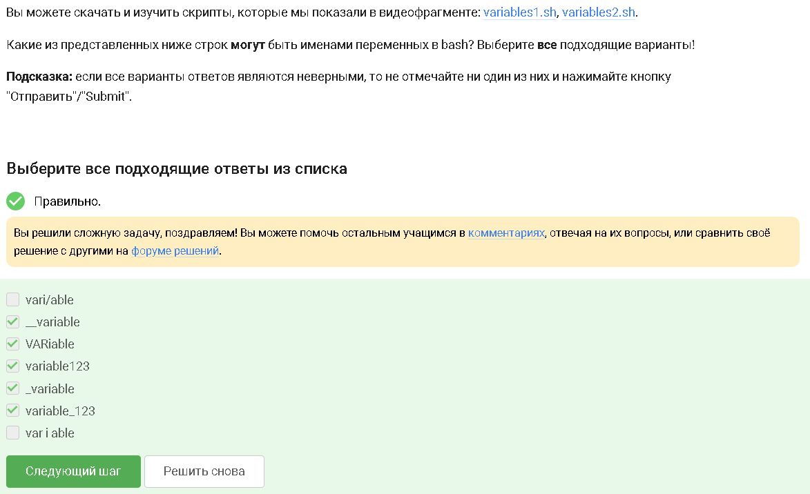{#fig-008 width=100% height=10%}

## Скрипт на bash, который принимает на вход два аргумента и выводит на экран строку следующего вида:

var1=$1

var2=$2

echo "Arguments are: \$1=$var1 \$2=$var2"

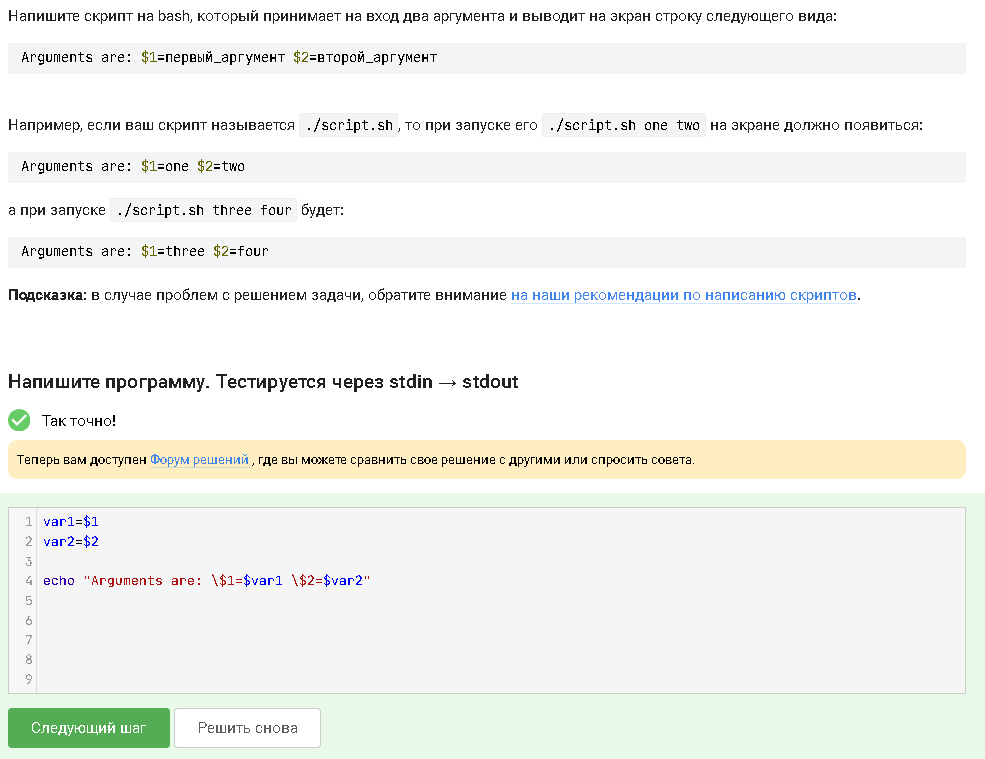{#fig-009 width=100% height=10%}

## Условия, при которых echo напечатает на экран True вне зависимости от того, с какими параметрами был запущен ваш скрипт и какие в нем есть переменные: 

$var1 == $var2 || $var1 !=$var2

$#-ge 0

-e $0

5 -ge 5

-z ""

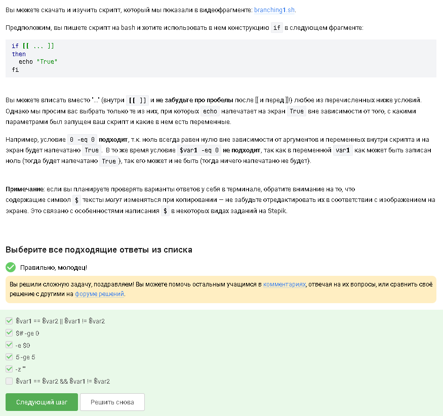{#fig-010 width=100% height=10%}

## Сначала four, потом four фрагмент bash-скрипта выведет на экран, если сначала этот скрипт запустили задав переменную var=3, а затем запустили еще раз, но уже с var=5.

### Анализ поведения

Случай 1: Скрипт запускается с `var=3`

1. `var` становится `3`.
2. `if [[ 3 -gt 5 ]]` -> `false` (3 не больше 5).
3. `elif [[ 3 -lt 3 ]]` -> `false` (3 не меньше 3).
4. `elif [[ 3 -eq 4 ]]` -> `false` (3 не равно 4).
5. Выполняется блок `else`.
6. `echo "four"` выводится на экран.

Случай 2: Скрипт запускается с `var=5`

1. `var` становится `5`.
2. `if [[ 5 -gt 5 ]]` -> `false` (5 не больше 5).
3. `elif [[ 5 -lt 3 ]]` -> `false` (5 не меньше 3).
4. `elif [[ 5 -eq 4 ]]` -> `false` (5 не равно 4).
5. Выполняется блок `else`.
6. `echo "four"` выводится на экран.

### Вывод

В обоих случаях скрипт выводит строку "four".

Таким образом, правильный вариант:

Сначала four, потом four

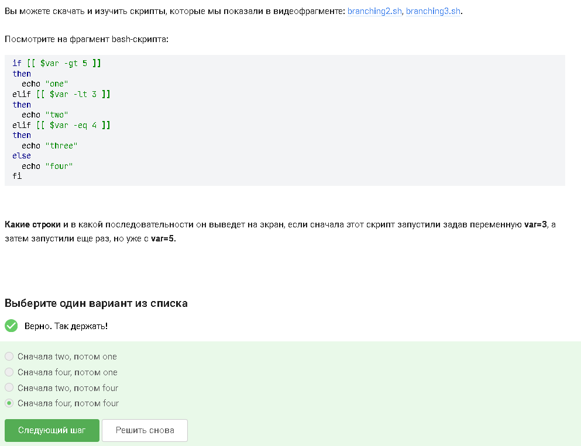{#fig-011 width=100% height=10%}

## Cкрипт на bash, который принимает на вход один аргумент (целое число от 0 до бесконечности), который будет обозначать число студентов в аудитории.

if [[ $1 -eq 1 ]]; then
    echo "$1 student"
elif [[ $1 -gt 1 && $1 -le 4 ]]; then
    echo "$1 students"
elif [[ $1 -ge 5 ]]; then
    echo "A lot of students"
else
    echo "No students"
fi

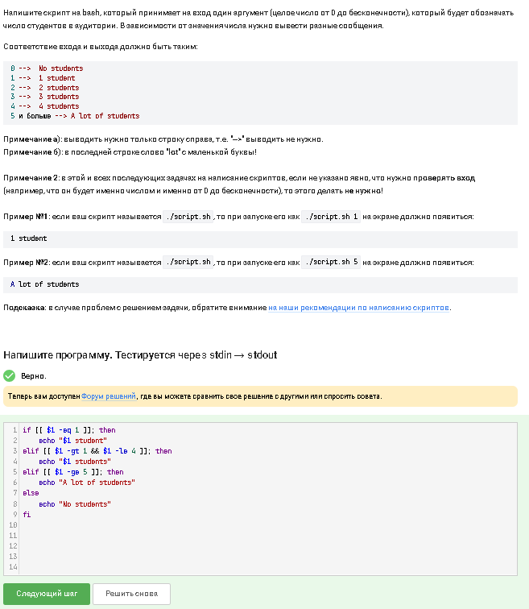{#fig-012 width=100% height=50%}

## Если запустить этот скрипт, то 5 раз "start" и 4 раза "finish" будут выведены на экран.

{#fig-013 width=100% height=50%}

## Скрипт на bash, который будет определять в какую возрастную группу попадают пользователи.

.PNG){#fig-014 width=100% height=50%}

.PNG){#fig-015 width=100% height=50%}

## Предложенные ниже инструкции на скриншоте увеличат значение переменной а на значение переменной b: 

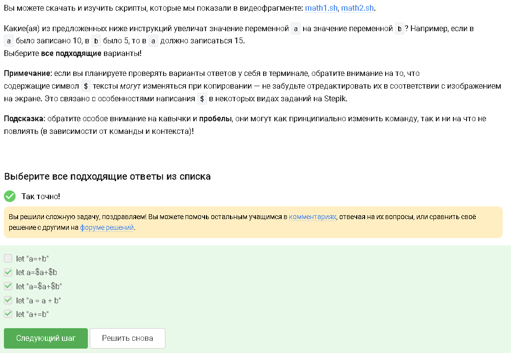{#fig-016 width=100% height=50%}

## Команда echo выведет на экран: 

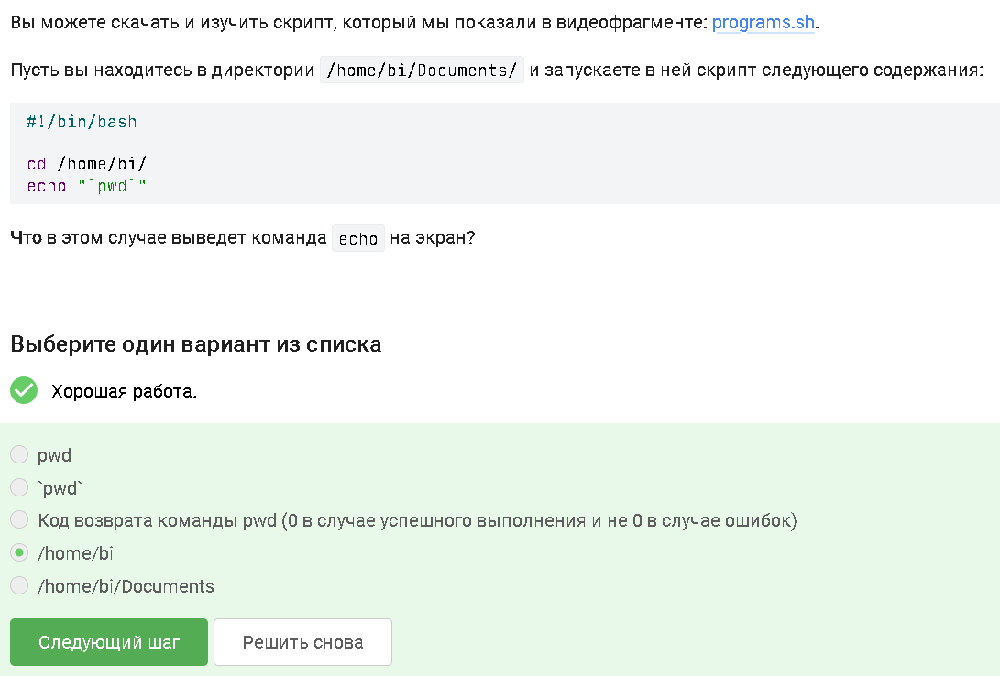{#fig-017 width=100% height=50%}

## Все верные утверждения или правильно работающие конструкции if:

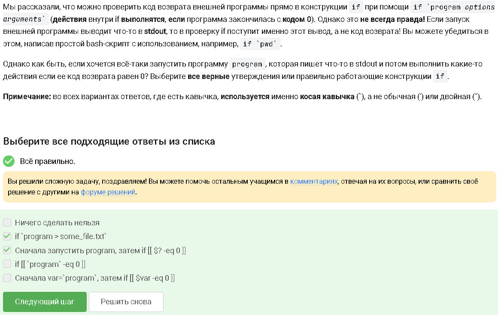{#fig-018 width=100% height=50%}

## Строка, которая выведет на экран команду echo "counters are $c1 and $c2", если она находится в скрипте после десяти вызовов функции counter с параметрами сначала 1, затем 2, затем 3 и т.д., последний вызов с параметром 10.

Объяснение: первая переменная локальная => пустая строка, вторая сумма арифметической прогрессии от 1 до 10 (55), но еще умноженная на 2 => 110

{#fig-019 width=100% height=50%}

## Скрипт на bash, который будет искать наибольший общий делитель (НОД, greatest common divisor, GCD) двух чисел.

.PNG){#fig-020 width=100% height=50%}

.PNG){#fig-021 width=100% height=50%}

## Калькулятор на bash.

.PNG){#fig-022 width=100% height=50%}

.PNG){#fig-023 width=100% height=50%}

## Все файлы, которые найдет команда find /home/bi -iname "star*", но НЕ найдет команда find /home/bi -name "star*":

Star_Wars.avi

STARS.txt

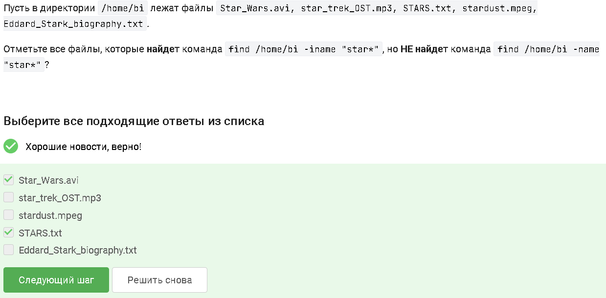{#fig-024 width=100% height=50%}

## Все верные утверждения из перечисленных ниже: 

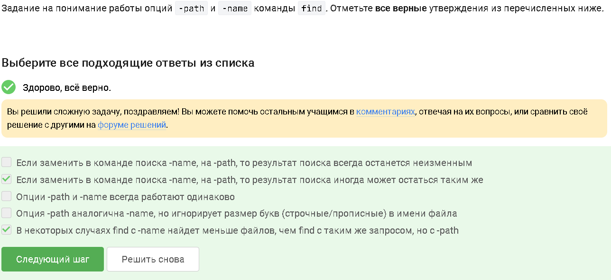{#fig-025 width=100% height=50%}

## Все кроме file3 будут найдены по команде find /home/bi -mindepth 2 -maxdepth 3 -name "file*"

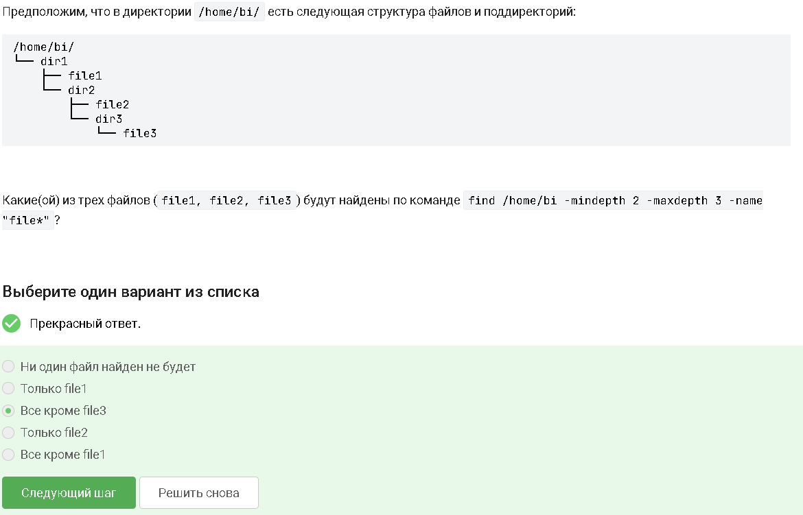{#fig-026 width=100% height=50%}

## Если выполнить на этом файле команды, то results.txt будет одинакового размера во всех случаях.

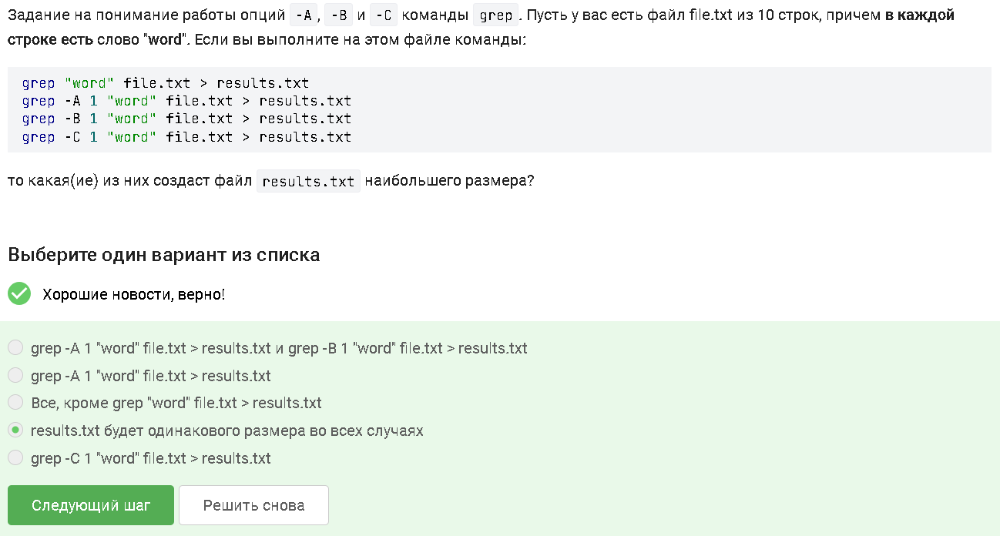{#fig-027 width=100% height=50%}

## На скриншоте варинты ответа, которые выведет на экран команда  grep -E "[xklXKL]?[uU]buntu$" text.txt.

![Варинты ответа, которые выведет на экран команда  grep -E "[xklXKL]?[uU]buntu$" text.txt.](image/3.5.5.PNG){#fig-028 width=100% height=50%}

## Если в команде sed -n "/[a-z]*/p" text.txt не указывать опцию -n, то каждая строчка будет выведена два раза.

{#fig-029 width=100% height=50%}

## Инструкция sed, которая заменит все "аббревиатуры" в файле input.txt на слово "abbreviation" и запишет результат в файл edited.txt

.PNG){#fig-030 width=100% height=50%}

.PNG){#fig-031 width=100% height=50%}

## Опцию -p, --persist нужно указать при запуске gnuplot, чтобы при его закрытии не были автоматически закрыты и все нарисованные в нём графики. 

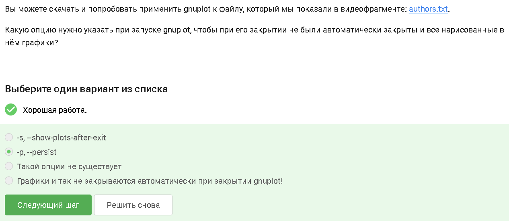{#fig-032 width=100% height=50%}

## Какое в этом случае будет название у построенного ряда данных и сколько будет нарисовано точек на графике? Название -- первое значение из второго столбца, нарисовано 9 точек (точка из первой строки пропущена).

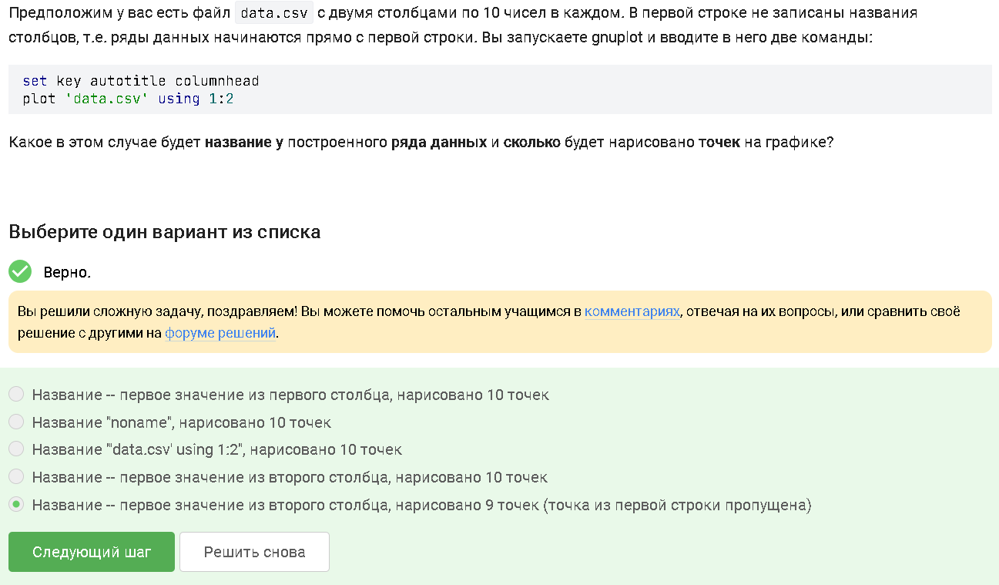{#fig-033 width=100% height=50%}

## Одна команда, которую нужно добавить в скрипт, для выполнения этой задачи.

.PNG){#fig-034 width=100% height=50%}

.PNG){#fig-035 width=100% height=50%}

## Изменил инструкции в файле move.rot (т.е. добавлять и удалять инструкции нельзя!) таким образом, чтобы:

График отразился зеркально относительно горизонтальной поверхности. То есть там, где была точка (10, 10, 200), станет точка (10, 10, -200), где была точка  (-10, -10, 200) станет (-10, -10, -200) и т.д. При этом точка (0, 0, 0) останется на месте.
Изображение стало вращаться в обратную сторону. То есть если раньше вращалось "влево", то теперь станет "вправо".
Вращение стало в два раза быстрее. То есть станет в два раза больше перерисовок графика на каждую секунду вращения.

.PNG){#fig-036 width=100% height=50%}

.PNG){#fig-037 width=100% height=50%}

## Команды, которые установят файлу file.txt права доступа rwxrw-r--, если изначально у него были права r--r--r--.

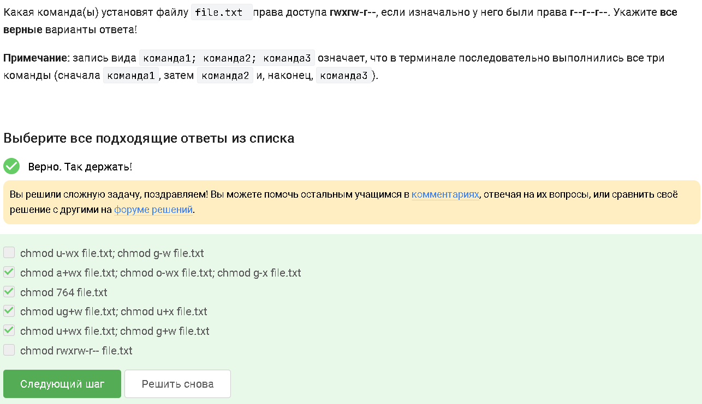{#fig-038 width=100% height=50%}

## После выполнения команды sudo chown user:group dir, sudo chmod o+w dir, sudo chown user dir, sudo chmod a+w dir user из группы group всё-таки сможет создать файл внутри dir.

.PNG){#fig-039 width=100% height=50%}

.PNG){#fig-040 width=100% height=50%}

## Характеристики файла, которые можно посчитать с использованием команды wc.

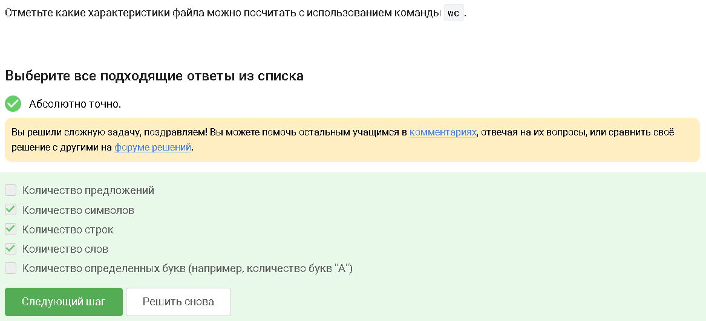{#fig-041 width=100% height=50%}

## Команда, которая выведет сколько места на диске занимает текущая директория (при этом размер нужно вывести в удобном для чтения формате (например, вместо 2048 байт надо выводить 2.0К) и больше на экран выводить ничего не нужно)

{#fig-042 width=100% height=50%}

## Максимально короткая команда (т.е. в которой минимально возможное число символов), которая позволит создать в текущей директории 3 поддиректории с именами dir1, dir2, dir3. 

{#fig-043 width=100% height=50%}

# Вывод

Ознакомились с Linux на более продвинутом уровне, получили более сложные навыки работы с Linux.
